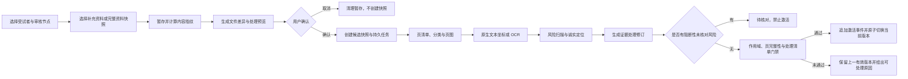

# Phase 4 技术设计

## 1. 设计原则

1. 原始资料不可变，识别和校对分层保存。
2. 快照是审核节点当时完整证据集合，不是上传批次的别名。
3. 文件、页面、识别配置和任务都具有确定性身份，重复动作可安全重放。
4. 只有确定性门禁能够发布活动快照；Agent 或 OCR 输出不能自行改变临床状态。
5. 定位精度必须由真实产物证明，界面不得用高亮外观掩盖坐标缺失。
6. 用户只看到中文临床工作语义，运行细节保留在可审计层。

## 2. 模块边界

| 模块 | 责任 |
|---|---|
| `app/domain/contracts` | 文件、快照、OCR、定位、校对和上传预览合同 |
| `app/domain/gates` | 作用域、快照集合、页完整性、定位真实性和发布门禁 |
| `app/storage` | SQLite 模型、追加写仓储、事务、租约和迁移 |
| `app/documents` | 文件指纹、格式探测、页清单、原生文本/坐标和页图生成 |
| `app/ocr` | OCR 后端适配、配置指纹、页级缓存、风险扫描和结果标准化 |
| `app/services` | 上传预览、确认、快照编排、校对和影响范围服务 |
| `app/workflow` | 持久任务、文件/页检查点、重试、取消和发布 |
| `app/api/v2` | 受试者、审核节点、上传预览、快照、页查看和校对 API |
| `frontend/src/features/evidence` | 宽屏上传与证据工作台、任务反馈和页级校对 |

旧 `projects/`、旧 OCR 缓存和旧审核接口只作为只读回归锚点，不被 V2 复用为持久化真相。

## 3. 核心数据模型

### 3.1 原始文件与资料版本

- `SourceBlob`：`sha256`、大小、媒体类型、只读存储路径、创建时间；`sha256` 唯一。
- `SourceDocumentVersion`：关联 `SourceBlob` 和稳定的 `logical_document_id`，保存原文件名、资料类型、来源方、项目/受试者/审核节点作用域、上传预览来源、页数、用户修订号及可选 `supersedes_version_id`。
- `SourceDocumentMetadataRevision`：资料类型、来源方及其修改理由的不可变修订；SourceDocumentVersion 不原地更新这些用户可改语义。
- 同一 Blob 可被多个资料版本引用；去重不合并临床作用域或用户可见的资料关系。

### 3.2 上传预览与快照

- `EvidenceUploadPreview`：短期候选，绑定作用域、上传方式、基准快照、创建时修订号和状态。
- `EvidenceUploadItem`：逐文件指纹、格式、大小、处理建议、重复关系、冲突和错误。
- `EvidenceUploadCommit`：确认动作、预览摘要哈希、幂等键、产生的任务和候选快照。
- `EvidenceSnapshot`：不可变完整文档版本集合、上传方式、前序快照或比较基线、集合哈希、创建时间和发布状态。
- 快照成员按逻辑资料记录活动版本；被替代版本仍可从旧快照和版本链回放。同成员集合的重复确认是 no-op，不新建快照。
- “同集合 no-op 目标”与“当前有效继承基准”是两个概念：仍在处理的候选可作为同集合重复确认的收敛目标，但只有审核节点当前活动快照可作为补充资料前序或完整资料比较基线。Slice 4.2 在活动指针表尚未落地时只接受 `ACTIVE` 状态；Slice 4.4/`0010` 建立活动指针后，必须以 `ReviewEpisode.active_evidence_snapshot_id` 为唯一权威，不得继续用创建时间推断当前活动快照。
- 上传预览取消采用 `staged → cancel_pending → cancelled`：先冻结确认入口，再删除并核实该预览自有暂存。清理失败保持待清理状态并允许重试，不得静默显示为已取消，也不得触碰共享原文件、快照或历史。
- `EvidenceProcessingRevision`：绑定一个快照和不可变处理清单；清单逐页冻结 PageArtifact、OCRProfile/OCRPage、定位器版本、当时生效的 CorrectionRecord、每份资料的 SourceDocumentMetadataRevision，以及 ReferencedDocument/ResolutionRevision 集合。
- `EvidenceActivationEvent`：追加写记录审核节点从哪个快照/处理修订切换到哪个版本、原因、触发任务、预期修订号和时间；回滚也是新的激活事件。
- `ReviewEpisode.active_evidence_snapshot_id` 与 `active_evidence_processing_revision_id` 只在候选通过全部门禁后，通过同一事务和预期修订号原子更新。
- 运行时只保留 `app.domain.contracts.review.ReviewEpisode` 一个审核节点合同；Phase 4 的成对活动指针加入该合同、ORM、仓储与 API。legacy `evidence_snapshot_id` 保留原有 fixture/审核链语义，但不得作为 Phase 4 当前资料版本的 fallback；`evidence_ingestion.py` 不再维护第二套同名真相。
- 完整处理修订的不可变终态与等待核对的过程状态分离：`EvidenceProcessingCandidate` 通过追加事件承载 `staged / processing / needs_attention / retryable_failure / ready / revision_conflict / cancelled / terminal_failure`，只有门禁闭合后才冻结一份 `complete` 处理修订。4.3 的 `base` 修订及其 payload/hash 保持逐字不变且永不可激活。

### 3.3 页产物与 OCR

- `OCRProfile`：后端、模型、参数、提示模板、页面渲染和标准化版本的稳定指纹。
- `PageArtifact`：文档版本、页码/原始 frame、页图、页图输入哈希、原生文本、原生坐标、尺寸、渲染器/解码器版本、派生物哈希和坐标变换版本。
- `OCRRun`：文件级运行、Profile、任务、状态和汇总。
- `OCRAttempt`：每次真实请求的开始/结束、失败类别、不可变原始请求/响应工件及哈希、工作租约代次、oMLX 租约和重试关系。
- `OCRPage`：页级原始文本、布局旁路结果、标准化文本、质量指标、风险项、缓存身份和成功/失败状态。
- 缓存唯一键：`source_sha256 + page_number/frame + page_input_hash + ocr_profile_hash + layout_parser_version + coordinate_transform_version`。

### 3.4 定位、引用与校对

- `EvidenceSpan` 沿用四级定位合同，并补齐页面尺寸/坐标系、定位产物版本和来源文本哈希。
- 正式定位身份包含页工件、来源层、来源文本哈希、目标原始范围或上下文锚点及算法版本；同页重复文本只有在可信同源 range 能指出具体 occurrence 时才可精确定位，不能再仅按“页 + 目标字符串”生成会碰撞的 ID。
- `OCRRiskScan/OCRRiskReview` 作为 4.3 `OCRPage` 之外的追加旁路工件：扫描只标出识别核对风险，不修改原 OCR、不归一化临床值、不解释入排逻辑；所有 blocking 风险只有被完整处理修订明确选中的核对记录覆盖后才解除激活阻断。
- `ReferencedDocumentRevision/ResolutionRevision`：不可变记录被提及资料、触发 span、确认/修改/解除状态、是否已提供及由哪个文档版本满足。
- `CorrectionRecord`：原始 OCR 引用、校对文本/结构化值、理由、风险类别、显式确认、修订号和受影响范围；追加写。
- 新校对从当前处理清单派生新的 `EvidenceProcessingRevision`；旧修订不读取“最新校对”，ReviewRun 后续必须同时绑定 snapshot 与 processing revision。
- 有效文本由固定 raw OCR 上的一组非重叠校对按原始 offset 确定性投影；校对永远不串接前一版 effective text。极性、数值、小数点、单位、日期和语义连接词变化必须二次确认；语义连接词校对只保存来源层变化，Phase 4 不据此改写方案规则的 AND/OR 结构。

## 4. 数据库迁移

按可回滚小迁移实施：

1. `0008_evidence_ingestion`：SourceBlob、逻辑资料/版本关系、SourceDocumentMetadataRevision、上传预览/条目/确认、快照成员和快照集合约束。
2. `0009_ocr_artifacts`：OCRProfile、PageArtifact、OCRRun、OCRAttempt、OCRPage、原始工件、EvidenceProcessingRevision/基础页清单、缓存唯一键和租约索引。
3. `0010_evidence_locator_corrections`：新增定位/校对/引用修订关联表、ActivationEvent、定位补充字段、CorrectionRecord、ReferencedDocumentRevision/ResolutionRevision 和影响范围。迁移不向 `0009` 已产生的基础处理修订补写关联；升级后通过限定范围任务新建完整处理修订，旧基础修订保持不可激活但可回放。

实施切片校正（2026-08-19）：Slice 4.1 已独立验收的 `0008_evidence_ingestion` 只包含六张
不可变证据基础表。为避免在验收后回改既有迁移，Slice 4.2 使用追加迁移
`0008a_evidence_upload_previews` 建立 EvidenceUploadPreview、EvidenceUploadItem 和
EvidenceUploadCommit；它的 `down_revision` 指向 `0008_evidence_ingestion`。后续
`0009_ocr_artifacts` 编号与职责保持不变。该调整只改变迁移拆分，不改变领域合同、升级顺序或
用户语义，并必须由 0007→0008→0008a→降级/恢复回归证明。

每次迁移前使用 SQLite backup API；迁移后验证 schema、外键、WAL、索引、内容哈希和 JSON payload/镜像字段一致。失败时恢复备份，不改写旧数据库。

## 5. API 合同

### 5.1 受试者和审核节点

- `GET/POST /api/v2/projects/{project_id}/subjects`
- `GET /api/v2/subjects/{subject_id}/review-episodes`

### 5.2 上传预览与确认

- `POST /api/v2/subjects/{subject_id}/evidence-upload-previews`
- `GET /api/v2/evidence-upload-previews/{preview_id}`
- `DELETE /api/v2/evidence-upload-previews/{preview_id}`
- `POST /api/v2/evidence-upload-previews/{preview_id}/commit`

预览请求携带审核节点、上传方式和基准修订号；确认请求携带预览摘要哈希和幂等键。服务端重新校验文件、作用域、快照基准和修订号，不信任前端摘要。

### 5.3 快照、页与校对

- `GET /api/v2/subjects/{subject_id}/evidence-snapshots`
- `GET /api/v2/evidence-snapshots/{snapshot_id}`
- `GET /api/v2/source-documents/{document_version_id}/pages/{page_number}`
- `GET /api/v2/ocr-pages/{ocr_page_id}`
- `POST /api/v2/ocr-pages/{ocr_page_id}/corrections`
- `GET /api/v2/evidence-processing-revisions/{revision_id}`
- `POST /api/v2/evidence-processing-revisions/{revision_id}/activate`
- `POST /api/v2/subjects/{subject_id}/referenced-documents`
- `PATCH /api/v2/referenced-documents/{referenced_document_id}`
- `POST /api/v2/referenced-documents/{referenced_document_id}/resolve`
- `DELETE /api/v2/referenced-documents/{referenced_document_id}/resolution`

页接口分别返回原文、原始 OCR、有效校对层、风险和定位能力，避免客户端把校对值伪装成原始结果。
被引用资料接口只处理用户登记或确定性候选确认、修改、解除和与已上传文件关联，不在 Phase 4 推断临床事实或规则影响。

## 6. 处理流程

文件和页面步骤均先查幂等产物，再持有数据库租约执行。任务重启从最后成功检查点继续；部分失败只重试失败页。候选发布之前，快照成员集合、文档作用域、页完整性、处理清单、定位产物哈希和风险核对状态必须再次核对。

`EvidenceUploadCommit + 候选快照 + 初始 Job + 幂等记录` 在同一事务中创建或复用；事务失败不得留下用户可见的孤立候选或活动任务。处理构建由独立 `EvidenceProcessingCandidate` 及追加事件保存过程状态，快照只表达文档集合候选，二者不得形成互相覆盖的双重当前状态。状态转换表如下，未列出的转换一律拒绝：

| 起始状态 | 事件 | 目标状态 | 必须通过的门禁 | 终态 | 重试范围 |
|---|---|---|---|---|---|
| staged | worker_start | processing | 工作租约代次匹配 | 否 | 当前候选 |
| staged | cancel | cancelled | 尚未开始不可中断步骤 | 是 | 无 |
| processing | checkpoint_success | processing | 步骤产物哈希/作用域匹配 | 否 | 下一未完成步骤 |
| processing | blocking_risk_found | needs_attention | 风险记录与页来源完整 | 否 | 仅风险页/处理修订 |
| processing | retryable_error | retryable_failure | 错误被分类为可重试 | 否 | 失败文件/页 |
| processing | terminal_error | terminal_failure | 错误不可重试或格式不支持 | 是 | 无；须新建候选 |
| processing | cancel_at_safe_boundary | cancelled | 已到安全边界 | 是 | 无 |
| processing | all_gates_passed | ready | 页完整、作用域、处理清单、定位和风险门禁 | 否 | 无 |
| retryable_failure | retry | processing | 租约已释放、重试预算未耗尽、输入未变 | 否 | 失败文件/页 |
| retryable_failure | cancel | cancelled | 无活动 worker | 是 | 无 |
| needs_attention | correction_or_resolution | processing | 新处理修订已创建、关键修改已确认 | 否 | 受影响页/清单 |
| needs_attention | cancel | cancelled | 无不可中断步骤 | 是 | 无 |
| ready | activate | active | 预期 ReviewEpisode 修订号匹配；同事务追加 ActivationEvent 并更新两个活动指针 | 是 | 无 |
| ready | revision_mismatch | revision_conflict | 当前活动版本已变化 | 是 | 无；须新建预览链 |

候选失败、取消或修订冲突不改变活动指针，也不把上一有效结果标记为需要更新；只有新的激活事件成功后，旧活动版本的当前投影才标记为已有更新版本。

`active`、`revision_conflict`、`cancelled` 和 `terminal_failure` 均为候选终态，不允许再发生候选状态跳转。活动版本上的后续动作属于新命令：

- 校对请求：在同一快照上创建新的 EvidenceProcessingRevision 候选和 Job，旧 active 版本保持不变；新候选从 `staged` 开始。
- 回滚请求：不重开旧候选，只验证目标旧快照/处理修订可完整回放，然后追加新的 ActivationEvent 并原子更新活动指针。
- 修订冲突后的“基于最新资料重试”：创建新的 Preview、Commit、候选快照和 Job；旧 `revision_conflict` 候选保持终态，不复用或改写。

## 7. OCR 与定位路线

### 7.1 原生 PDF

正式路径使用现有 `pdfplumber` 读取字符/词对象和坐标，统一转换到页图坐标系。若 PDF 无可靠文本层或字符映射异常，进入扫描页路线，不把提取失败当空白页。

### 7.2 扫描页与照片

先做完整 PaddleOCR-VL 布局能力试验，验证布局分析、裁剪、识别、阅读顺序和坐标回映是否在当前环境稳定。现有 oMLX VLM 通道保留为文本识别后端；若其只返回纯文本，则最多形成文本范围、页内摘录或仅页码定位。

### 7.3 其他文件格式

- DOCX/DOC：保存原文件，以版本固定的 LibreOffice 无头模式派生 PDF；记录 LibreOffice 版本、参数、派生 PDF 哈希、退出状态和页数，再按 PDF 路线生成页图。派生失败、页数为零或渲染不稳定时整份文件失败，不回退到 legacy 纯文本伪分页。
- TXT：按 UTF-8、UTF-8-SIG、GB18030 的固定顺序尝试解码，记录实际编码；保持原始行序并形成单个逻辑文本页，只允许文本范围/摘录定位。
- TIFF/TIF：逐 frame 清点并生成页图，frame 索引即页序；其他图片为单页。解码失败的 frame 明确为失败页。
- 所有派生物都是可复现工件，不替代原文件；页面身份包含原始内容哈希、渲染器/解码器版本和页图输入哈希。

### 7.4 风险扫描

在 OCRPage 上同时保存模型原文和结构化风险：

- 否定/肯定词及其支配范围；
- 数值、小数点、比较符号和参考区间；
- 单位和倍数；
- 完整日期、部分日期及互相矛盾日期。

风险扫描不擅自修正文义，只决定该页是否需要核对及发布门禁是否可继续。Slice 4.0 冻结等级矩阵：可能改变极性、关键数值、小数点、单位或日期解释的风险必须核对后才可激活；纯提示性风险可随处理修订保留但不阻断。

### 7.5 全局并发

共享 oMLX 工作负载门禁是全局 8 路的唯一额度来源，计数单位为一个正在执行的真实外部 OCR 推理请求；页面、裁剪块或布局流水线每次实际模型调用各占一个租约，本地解码/布局不占额度。数据库租约仅防止同一页被重复 worker 执行，不参与并发计数。

获取顺序固定为“页工作租约 -> oMLX 排队/租约 -> 推理”；长请求续租，两者在 `finally` 释放。页面渲染另设较低并发和内存背压。worker 提交结果时必须同时核对页工作租约代次、输入哈希和处理修订状态；失效 worker 的晚到结果可留作尝试审计，但不得进入缓存成功项、处理清单或活动版本。

## 8. 前端信息架构

### 8.1 入口和路由

- 受试者列表的每个审核节点提供“资料”入口。
- 个例工作台提供“查看/补充资料”深链。
- 主路由：`/subjects/:subjectId/evidence?episode=...`；不新增顶级导航项。

### 8.2 三栏工作台

- 顶部固定上下文带：项目、受试者、审核节点、方案版本、当前资料版本、待处理数量和返回入口；上传与校对全过程不消失。
- 左栏：快照选择、文件分类、页清单、处理状态和失败页。
- 中栏：识别文本、结构化风险、校对编辑和定位精度。
- 右栏：原文件/页图、真实高亮、缩放和页码。PDF、图片、多页 TIFF 和文档派生 PDF 均归一为按实际页序连续滚动的页容器；长文件只虚拟化离开可视区的页面内容，不改变稳定页序和滚动锚点。
- 每页使用稳定的原始页面坐标系保存定位区域，渲染层根据页图固有尺寸、当前容器宽度和缩放比例计算覆盖层变换。只有通过定位真实性门禁的 `bbox` 才绘制 `#C00000` 红框；`text_range`、`page_excerpt` 和 `page_only` 仅显示对应文字/页码提示，严禁由摘录位置估算矩形。
- 从中栏选择证据时，右栏滚动到目标页并在该页进入视口后定位目标区域；用户主动滚动期间不持续回拉。点击页清单、中栏证据和右栏页码更新同一选择状态，避免三套页码状态漂移。
- 完整资料模式在确认区单列“上一资料版本中存在、本次未选择”的文件；同名异内容文件必须选择“作为新版本”或“并列保留”。逐文件提供移除、分类、来源方、版本关系和明确下一步动作。
- “资料中提及但未提供”在左栏独立分组，中栏可确认/修改/解除，右栏打开其触发原文或后续关联文件。
- 三栏使用 `minmax()` 和容器查询，允许用户拖动分栏但不固化屏幕像素；仅支持有效 CSS 宽度不低于 1280 的宽屏组合。1080P 到 4K 保持同一工作模型，不为窄屏另造导航或工作流。

### 8.3 中文业务文案

- `incremental` 显示为“补充资料”。
- `full` 显示为“建立完整资料快照”。
- `stale` 显示为“资料已变化，结果需要更新”。
- 模型、缓存键、Job、checkpoint、payload、revision 等不作为主界面词汇；必要时转译为“处理方式、处理进度、资料版本、修改冲突”。

视觉采用康哲站点轨：浅色顶栏和背景、橙色身份线、风险红仅用于需要处理的风险；不做卡片套卡片、深色科技风或装饰性大面积渐变。

## 9. 兼容、回滚与可观察性

- V2 新表和新 API 与旧项目物理隔离；旧数据只读。
- 候选快照、OCR 页、处理修订、校对记录和激活事件均追加写；活动指针只缓存最后一条有效激活事件，回滚通过新的激活事件完成。
- 部分失败时页面明确展示文件/页、原因、已完成范围和可重试动作；不把运行日志当临床证据。
- 关键指标：去重命中、OCR 缓存命中、页失败率、关键风险漏检/页面误报、风险核对率、文本回读一致率、目标定位成功率、定位精度分布、真实推理并发峰值、晚到结果拒绝数、任务恢复成功率和页面首开时间。
- 若布局能力试验失败，回滚到文本识别与诚实降级，不阻塞上传/快照主链，也不虚构 bbox。
