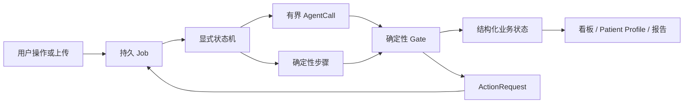
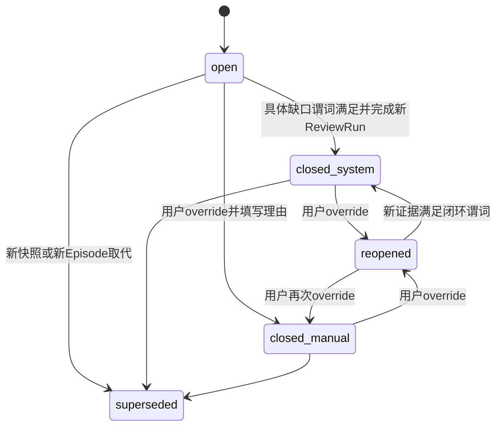

# 入排审核系统 V2 最终架构设计

**状态：** 扩大会商修订版，等待用户批准实施  
**日期：** 2026-08-12  
**来源：** 三轮用户确认、现有工程/历史/运行审计、首轮独立审查、Kimi K3 与 CodeBuddy GLM-5.2 扩大独立会商、Codex 主会场核验  
**配套计划：** `plans/REARCHITECTURE_IMPLEMENTATION_PLAN_20260812.md`

## 1. 产品定位

### 1.1 目标

构建一套单台 Mac、本地单用户、双击直接进入的 AI lead 入排审核工作台：

- 由研究方案和现行修订案生成项目级、期别明确、分审核节点的结构化入排规则；
- 可选接收 Q&A、澄清函、邮件或医学解释，对方案模糊处提供有来源的解释；
- 接收受试者在预筛、筛选、导入/洗脱、基线/随机等节点逐步提供的病历和检验检查资料；
- 形成从最早可证明事件到当前审核节点的入排 Patient Profile；
- 对每个规则组件给出当前证据下的判断、证据强度、风险、冲突和下一步行动；
- 明确说明应由研究者方、CRC、CRA或申办方医学/项目组补什么、如何补、何时补；
- 系统输出是 AI 辅助审核工作底稿，不代替最终入排决定。

### 1.2 非目标

- 不构建多账户、注册、管理员、项目所有权或审批流；
- 不让多个 Agent 自由讨论后直接写入临床结论；
- 不把 Q&A 或医学解释伪装成方案新版本；
- 不把旧项目数据直接迁移成新系统业务真相；
- 不继续在旧 Markdown 审核器中累加项目特异正则补丁；
- 不在首屏无差别展示所有正常检验结果。

## 2. 已冻结的产品决定

1. **本地单用户：** 删除登录，桌面入口直接进入系统。
2. **研究边界：** 独立 II 期、独立 III 期和非无缝 II/III 分别建项目；只有方案明确为 seamless/adaptive II/III 且同一队列连续过渡时合并。
3. **审核节点：** 项目期别与预筛/筛选/导入/基线等审核节点是两个维度。
4. **上传：** 增量上传去重合并并重跑受影响范围；全量上传新建完整证据快照，旧快照不删除。
5. **阶段隔离：** 后续阶段资料不静默改写早期审核；回顾重审必须显式创建新 ReviewRun。
6. **证据冲突：** 并列展示并阻断被争议组件的明确化，不自动选择任一来源。
7. **校对：** 原文件和原 OCR 不变；校对文本/事实另存，极性或数值变化需明确确认，并重跑受影响范围。
8. **旧项目：** 只读反面锚点和回归来源；V2 项目从方案开始重新创建。
9. **原型优先：** 先用版本化 fixture/API 合同构建真实前端壳，经脚本化、可量化 UAT 批准项目/工作队列、Patient Profile和规则/证据工作台，再实施数据层。

## 3. 总体架构裁决

### 3.1 Graph engineering 的使用方式

采用 Graph 的**控制思想**，首版不引入 LangGraph 运行依赖。运行骨架为：

- SQLite/WAL 持久数据库；
- Job/Checkpoint 本地后台任务；
- 显式、可测试的状态机；
- 有严格 JSON Schema 的语义 Agent 调用；
- 确定性规则门控；
- 由结构化事实生成 UI 和报告投影。

LangGraph 只保留为后续候选：当显式状态机在人工暂停、恢复或复杂分支上出现可证明的维护负担时，再通过同一接口替换编排层。数据库实体和业务状态不依赖 LangGraph。

### 3.2 运行图

### 3.3 技术基线

- 后端：保留 FastAPI，按领域模块重组，不延续大路由文件。
- 数据库：SQLite/WAL + SQLAlchemy 2 + Alembic；文件系统只保存原文件、页图和大对象。
- 前端：新建 React + TypeScript + Vite 组件化 SPA；使用 TanStack Table 支撑逐列筛选/排序，保持自有视觉系统。
- 发布：开发期使用 Node 构建；桌面启动时只运行预构建前端、FastAPI和oMLX，不要求用户操作 Node。
- 模型：当前 DeepSeek V4 Flash `reasoning_effort=max` 作为语义节点初始基线；每个节点独立配置和记录，不在业务代码写死。
- OCR：保留 oMLX OCR 适配器和最大 8 路准入，缓存键升级为文件内容哈希 + 页码 + OCR模型/参数版本。

React/TypeScript、Vite、TanStack Table、SQLAlchemy和Alembic均使用成熟的开源实现；具体依赖版本在实施阶段固定并记录许可。

## 4. 领域模型

### 4.1 方案与项目

| 实体 | 责任 |
|---|---|
| Project | 一个明确研究期别或无缝研究项目 |
| ProtocolDocumentVersion | 方案原文件、正式版本号、日期、哈希 |
| Amendment | 唯一可改变标准的正式修订来源 |
| InterpretationSource | Q&A、澄清函、邮件、医学解释；只能解释模糊处 |
| RuleSet | 绑定正式方案版本的结构化规则集 |
| RuleModelRevision | 内部抽取/人工编辑修订号，不展示为方案版本 |
| Rule | 官方 IN/EX 父级编号、原文、适用研究部分 |
| RuleComponent | 子组件、表达式节点、阈值、单位、时间窗、例外、证据要求 |
| EvidenceRequirement | 规则组件在指定节点所需的事实、记录、检查/评分或文件类型 |
| WorkflowStage | 从研究流程表抽取的审核节点、应做项目和最晚完成点 |

每个受试者 ReviewRun 必须绑定：正式方案版本、RuleModelRevision、研究期别、审核节点和证据快照。

RuleComponent 不保存一段供模型自由解释的条件文字，而保存可验证的表达式树：

- 逻辑节点：`ALL / ANY / NOT`，允许有限嵌套并保留官方父子编号；
- 原子谓词：对象、属性、比较符、值、单位、适用人群和必要的研究者判断；
- 时间约束：锚点类型、前/后方向、窗口、半衰期规则和部分日期容许度；
- 例外树：例外同样使用 `ALL / ANY / NOT`，不得把“和”弱化成“或”；
- 证据要求：最低证据类型、应询问/应执行项目、允许的转述来源和到期节点。

Agent 可提出表达式草稿；只有通过 Schema、编号、逻辑、单位和时间门控后才能发布。

### 4.2 受试者与证据

| 实体 | 责任 |
|---|---|
| Subject | 受试者、中心、人口学基础信息 |
| ReviewEpisode | 预筛/筛选/导入/基线等节点、锚点、截止时间 |
| ReviewRun | 一次可复现审核；不覆盖旧运行 |
| EvidenceSnapshot | 当前审核使用的完整证据集合 |
| SourceDocumentVersion | 文件哈希、类型、来源、上传模式、版本 |
| OCRPage | 原 OCR、模型/参数、质量、页图 |
| CorrectionRecord | 原值、校对值、理由、确认、影响范围 |
| EvidenceSpan | 文件、页、区域/文本范围、原文、证据类型 |
| ReferencedDocument | 病历引用但未提供的已知资料 |
| EvidenceExpectation | 由 EvidenceRequirement × WorkflowStage × ReviewEpisode 投影出的“本节点应存在什么” |

EvidenceSpan定位支持 `bbox / text_range / page_excerpt / page_only`，并保存定位算法版本、锚点哈希、匹配置信度和降级原因：

1. 原生 PDF 文字可优先用 PyMuPDF word box 形成 `bbox`；
2. OCR仅有文本时，以规范化文本锚定形成 `text_range`，多处命中必须消歧；
3. 不能稳定定位字符时展示 `page_excerpt`；
4. 只能确认页码时使用 `page_only`。

页面必须显示实际定位精度，不能用高亮样式伪装不存在的坐标。Phase 4 先验证 oMLX 是否可返回布局信息；若不可用，再以独立 sidecar 布局识别作为可替换候选。

EvidenceExpectation 状态为 `observed / observed_weak / referenced_missing / absent / not_due`。它使“应有而没有”成为可点击、可行动、可统计的对象，避免事实时间轴把“未记录”误看成“正常”。

### 4.3 临床事实与 Patient Profile

| 实体 | 责任 |
|---|---|
| ClinicalFact | 数值/陈述、单位、否定、时态、确定性、来源强度 |
| ClinicalEvent | 诊断、症状、病程、检查、评分、手术、住院等事件 |
| MedicationExposure | 药名/类别、适应证、剂量、频次、途径、起止和来源类型 |
| ConflictGroup | 同一事实的冲突来源，不自动择优 |
| FactRuleLink | 事实与RuleComponent双向依赖，支持增量重算 |

Patient Profile主题泳道：

1. 研究节点；
2. 人口学与基线特征；
3. 目标疾病历程；
4. 症状与体征；
5. 既往史/现病史；
6. 用药暴露；
7. 非药物治疗/操作；
8. 检验检查/评分；
9. 过敏/感染/免疫；
10. 生育相关；
11. 社会和环境暴露；
12. 家族史、既往研究、献血/输血/移植等特殊经历；
13. 证据、冲突和资料质量。

后台保存全量事实，首屏只突出入排相关、异常、临界、趋势变化和风险事件。

## 5. 规则判断模型

### 5.1 组件级内部状态

- 入选：`满足 / 不满足 / 暂不能明确 / 需专业判断 / 存在冲突 / 尚未到期 / 不适用`
- 排除：`未触发 / 已触发 / 暂不能明确 / 需专业判断 / 存在冲突 / 尚未到期 / 不适用`

项目和受试者页面不再使用一个 `overall_verdict` 覆盖全部节点。

### 5.2 判断状态与缺口原因一致性门控

| 判断状态 | 事实条件 | 允许的缺口 |
|---|---|---|
| 满足/未触发/不满足/已触发 | 必要事实和组件完整、确定性达标 | 无阻断缺口；可有非阻断溯源待办 |
| 暂不能明确 | 事实或证据不足 | 必须有明确 gap_type |
| 需专业判断 | 客观事实充分，方案要求的判断缺失 | `professional_judgment` |
| 存在冲突 | 同一组件存在未解决冲突 | `source_conflict` |
| 尚未到期 | 当前节点尚不要求完成 | `future_stage_not_due` |

不满足矩阵的 Agent 输出直接被 Gate 拒绝，不通过文本正则“修成合理”。

### 5.3 缺口分类

- `record_incomplete`：病历本应询问/记录但未提及；
- `description_insufficient`：已提及但缺关键细节；
- `historical_source_unavailable`：方案明确要求同期/客观证明，或现有转述不足以满足组件证据要求，且既往来源无法取得；
- `referenced_file_missing`：病历明确引用的已知文件未上传；
- `required_procedure_not_done`：当前节点必做检查/评分未完成；
- `result_fields_missing`：报告缺数值/单位/范围/日期/关键页；
- `date_or_anchor_missing`：病程/洗脱/基线锚点不可计算；
- `professional_judgment`：研究者特定判断缺失；
- `source_conflict`：来源冲突；
- `ocr_or_parse_risk`：否定词、数值、单位、日期或结构不可靠；
- `interpretation_conflict`：解释材料与方案/修订案冲突；
- `future_stage_not_due`：后续节点尚未到期；
- `provenance_followup`：方案未要求额外客观证明，当前筛选病历转述可用但来源较弱，需加强溯源；该项默认非阻断。

### 5.4 病史证据规则

- 病历明确否认：已有证据，不因缺少独立表格自动判缺失；
- 病历完全未提及：记录不完整，不能当作否认；
- 阳性既往史/长期病程只有筛选病历转述：当前可用，并生成**加强溯源待办**；
- 既往同期资料和当前转述冲突：并列、阻断该组件明确化；
- 方案未要求客观证明时，不自行增加“必须取得既往原始病历”的入排条件。

加强溯源不是绿色通过旁的一行小字，而是非阻断、可计数、可追踪的 ActionRequest。页面显示可为：`当前证据支持（转述来源，溯源待办1）`。

### 5.5 节点状态汇总

受试者列表中的节点状态由纯函数计算，不读取模型总结文本。输入是该 ReviewEpisode 下所有 RuleComponent 状态、gap_type、blocking_level 和 EvidenceExpectation，输出为主状态、分类计数和排序键。

主状态优先级固定为：

1. `明确障碍`：入选组件确定不满足或排除组件确定触发；
2. `当前节点缺口`：到期的必需资料、记录、检查、评分、锚点或结果字段不足；
3. `存在冲突`：来源或权威解释冲突，争议组件不能明确；
4. `需专业判断`：客观事实已齐，但方案要求的研究者判断缺失；
5. `后续节点关注`：仅有尚未到期项目；
6. `未发现明确障碍`。

`provenance_followup` 不提升为阻断状态，单独显示为 `溯源待办 n`。OCR/解析风险只要影响当前组件明确化，就归入当前节点缺口并保留自己的分类计数。所有主状态映射、计数和排序都用表驱动单元测试覆盖。

## 6. ActionRequest 与闭环

### 6.1 结构

每个行动至少包含：

- `action_id`
- `rule_component_id`
- `gap_type`
- `target_party`：研究者方/CRC/CRA/申办方医学或项目组
- `requested_action`
- `acceptable_evidence`
- `due_stage`
- `blocking_level`：由规则类型、节点和缺口矩阵计算，不由LLM自由填写
- `trigger_evidence_span_id`
- `state`
- `recompute_scope`
- 不可变 transition log

OCR校对属于系统内部校对任务，不混入四类临床责任方。

### 6.2 状态机

系统自动关闭只能针对同一 RuleComponent 的具体缺口：

- 无关文件上传不得关闭；
- 研究者判断缺口必须出现具名、日期、来源明确且针对该组件的判断；
- 冲突缺口必须有明确的冲突核实记录；
- 解释冲突必须有不违背方案/修订案的权威澄清；
- 行动关闭不等于规则通过；结论改变必须生成新的 ReviewRun。

## 7. Agent 与确定性代码边界

### 7.0 节点合同

| 节点 | 类型 | 结构化输出 | 写权限 | 失败处理 |
|---|---|---|---|---|
| Protocol Deconstructor | 语义 Agent | Rule/RuleComponent/WorkflowStage 草稿 | 仅写 draft | Gate拒绝后同会话限次修复；仍失败则停在草稿 |
| Evidence Normalizer | 语义 Agent | Fact/Event/Medication/ReferencedDocument 候选 | 仅写 candidate | 无法回源的候选拒绝并形成解析任务 |
| Eligibility Assessor | 语义 Agent | 组件语义判断候选、使用事实、缺口建议 | 仅写 candidate | 不生成最终状态；Gate失败则重试或转人工 |
| Safety/Provenance Critic | 条件 Agent | `veto / downrank / open_action / none` | 仅写 CriticRun | 无EvidenceSpan不得否决；失败不覆盖原判断 |
| Protocol/Fact/Assessment/Action Gates | 确定性代码 | 已接受实体、最终组件状态、转移事件 | 按实体边界写入 | 失败即停，不用正则修补成“通过” |
| Projection/Report | 确定性代码 | 看板、Profile、差异、报告 | 只写可重建投影 | 由同一结构化真相重建 |

每次 AgentCall 记录 `node_id`、输入范围哈希、模型、reasoning参数、PromptVersion、Schema版本、尝试次数、耗时、费用、原始输出哈希和Gate结果。Agent之间不共享自由文本 scratchpad；只通过已验证实体交接。首版只保留一个条件 Critic，证据强度、来源冲突检测和溯源待办尽量由确定性代码完成；只有评测证明两个独立上下文能显著降低错误时，才拆为 Safety 与 Provenance 两个 Agent。

### 7.1 方案图

1. **Protocol Deconstructor Agent**：生成元信息、研究期别、规则和流程节点草稿。
2. **Deterministic Protocol Gate**：核对官方父级数量/编号、期别、逻辑结构、流程覆盖和方案版本。
3. **用户工作台**：原文、旧稿、新稿、逐条diff、手工编辑和继续对话。
4. **Publish**：发布绑定方案版本的RuleModelRevision。

### 7.2 受试者图

1. 文档指纹/分类/OCR；
2. OCR极性、数值、日期和完整性门控；
3. **Evidence Normalizer Agent**：生成事实、事件、用药和引用文件候选；
4. 确定性日期、单位、重复、冲突和来源门控；
5. Patient Profile投影；
6. **Eligibility Assessor Agent**：逐RuleComponent生成候选判断；
7. 确定性逻辑、阈值、时间窗、例外和一致性门控；
8. **Safety/Provenance Critic Agent（条件触发）**：仅对高风险、冲突、低质量OCR或Gate异常进行独立否决/降级/开行动；
9. 确定性 Evaluator 计算最终组件状态、ActionRequest、节点汇总、报告和导出。

### 7.3 必须确定性实现

- 文件哈希、去重、快照、阶段隔离；
- IN/EX编号和父子层级；
- ALL/ANY/NOT、阈值、单位、部分日期上下界和洗脱期；
- 例外条件的完整组件检查；
- ActionRequest转换、幂等和自动关闭；
- Job重试、租约、取消和恢复；
- 主状态与计数、Markdown/HTML导出；
- Q&A与方案的权威关系。
- EvidenceExpectation覆盖状态、stale影响范围和ReviewRun差异。

## 8. 功能与界面架构

### 8.1 全局导航

- 今日工作
- 项目看板
- 方案解构工作台
- 受试者/Patient Profile
- 行动中心
- 报告导出
- 任务与系统
- 系统帮助

不显示登录页。Phase 1 同时提供“今日工作”和“项目看板”两种首屏原型：前者突出运行中任务、当前节点到期行动、冲突和近期变化，后者突出项目/受试者全局状态；经脚本化 UAT 决定默认首屏，两者均保留为一级入口。

### 8.2 方案工作台

- 首次方案：上传后自动提取项目名称、编号、版本、日期；识别期别并在需要时询问；
- 重新解构：选择项目后显示当前方案/规则、上传新方案、解释材料和反馈框；
- 当前结果与新结果并列，逐条显示新增、删除、修改、逻辑/时间窗/证据要求变化；
- 支持手工编辑、继续对话、重新解构、取消、保存；
- 保存前必须通过编号、父子逻辑、期别和流程节点门控。

### 8.3 项目看板

每个受试者按审核节点展示主状态和计数，例如：

`明确障碍1｜记录不完整2｜证据缺口1｜冲突0｜需专业判断1｜溯源待办2｜后续关注3`

排序先看当前节点阻断程度，再看最晚完成节点，再看缺口类型。每列支持筛选和排序。

节点单元格可直接进入对应 ReviewEpisode，不再要求先在页面顶部切换阶段。单元格同时显示主状态和各类计数；溯源待办与阻断缺口分开显示。

### 8.4 Patient Profile

- 顶部：人口学、目标疾病状态、当前节点、锚点、快照、待办数量；
- 默认页：主题泳道和关键事件摘要；
- 点击事件：显示关联规则、风险、行动和原始证据；
- 默认隐藏无关正常检查，允许进入完整明细；
- 增加“应备证据覆盖”泳道，显示 observed/弱证据/引用未提供/未见/未到期；
- 事件时间和记录时间分开；部分日期显示精度和上下界；
- 同一事实的冲突来源并列展示。

### 8.5 入排工作台

桌面采用可调整分栏：

1. 规则树和父子逻辑；
2. 组件事实、判断、缺口、行动和ReviewRun差异；
3. 识别文本与原始文件查看器，可按EvidenceSpan同步滚动和高亮。

三者保持同步选择。窄屏改为堆叠标签页，但保留同一rule/fact/evidence选择状态，不依赖全页面横向滚动。

页面级不出现横向滚动；极密表格可在组件内部横向滚动。布局使用CSS Grid/Flex、`minmax()`、容器查询和相对尺寸，不以固定像素宽高作为主要布局策略。支持键盘切换规则、打开证据和返回上一项，状态不只依赖颜色表达。

### 8.6 行动中心

- 按责任方、到期节点、gap_type、阻断程度、项目和中心筛选/排序；
- 每项显示“为什么需要、需要补什么、何种证据可关闭、关联规则和来源”；
- 支持按责任方导出工作清单并深链回受试者工作台；
- 系统自动关闭、人工override、重开和supersede均展示不可变差异记录；
- 新证据引起的ReviewRun提供前后组件状态、事实、Action和证据定位差异。

### 8.7 上传与批处理

- 同一受试者明确选择“增量上传”或“全量上传”；
- 增量上传展示重复、已合并、新增、受影响规则；
- 全量上传展示新快照与旧快照关系；
- 批量任务由后台Job运行，浏览器关闭不取消；
- OCR和LLM在依赖允许时跨受试者流水并行；OCR全局上限8；
- 支持批量审核、重置OCR、重新审核、个人报告导出；
- 中心信息为全局库，单用户可增删改和批量导入。

Job详情按页/文件/受试者/节点显示状态、失败原因、影响范围和可重试粒度。失败文件关联的Fact/Assessment显示 `stale`，不得继续伪装为最新。取消只在安全节点边界生效并保留Checkpoint；批量运行前显示按历史中位数估计的时间和费用区间，明确标注为估算。

### 8.8 报告

- 个人报告：完整Patient Profile、逐条规则、证据、判断、风险和行动；
- 中心/项目报告：只汇总明确障碍、记录/证据缺口、冲突、专业判断和待办；
- Markdown为机器可读/通用底稿；HTML为主要阅读报告；
- 报告不展示内部模型日志、指令性措辞或项目特异调试信息；
- 每份报告写明方案版本、RuleModelRevision、审核节点、证据快照和生成时间。

## 9. 运行、恢复与数据保护

运行审计实体包括 `Job`、`JobStep/Checkpoint`、`AgentCall`、`PromptVersion`、`ModelConfig`、`GateResult` 和 `ProjectionRevision`。业务实体与运行日志分离，运行日志不能成为临床判断来源。

- Job在浏览器请求前落库，SSE只订阅状态；
- 每个步骤完成后写Checkpoint；
- 重启后从最后成功步骤恢复；
- 处理锁采用数据库租约，不使用仅进程内锁作为唯一保护；
- 同一文件、同一模型/参数、同一页的OCR幂等；
- 同一输入、提示版本、模型和节点的AgentCall可追踪；
- 人工可编辑记录带 `revision`；提交必须携带打开时的revision，两标签页冲突时显示差异并要求显式重放；
- 文档、事实或规则变化后，受影响但尚未完成新ReviewRun的投影标记为 `stale`；
- SQLite schema迁移前自动备份数据库，迁移脚本可回滚；
- 原始文件、旧快照、旧报告和ActionTransition不物理覆盖；
- 旧项目目录强制只读写保护，V2不得调用旧项目写API。

## 10. 旧系统的保留与淘汰

### 保留

- 上传和路径安全经验；
- OCR/oMLX适配器和8路准入；
- 真实错误案例、既有测试和临床安全知识；
- 中心、批量、报告和桌面入口需求；
- 旧项目作为只读对照。

### 不直接复用为V2核心

- `static/index.html`单文件SPA；
- `overall_verdict`和旧五态聚合；
- SSE请求拥有任务生命周期；
- Markdown规则作为业务真相；
- `reviewer.py`自由文本解析与项目特异后处理；
- mtime OCR缓存；
- 注册、admin、多账户和项目所有权。

“从头创建项目”不等于丢弃旧知识。旧错误案例将转换为结构化fixture和确定性门控测试，但旧结论不得被导入为V2真相。

## 11. 设计验收门槛

实施不得越过以下门槛：

1. 版本化 fixture/API 合同通过Schema检查，原型使用真实前端壳且用户完成脚本化 UAT；
2. 方案父级IN/EX数量和编号与原文100%一致；
3. 所有展示的关键事实和判断均可回到EvidenceSpan，并诚实显示 `bbox/text_range/page_excerpt/page_only` 精度；
4. 沉默不被识别为否认；低质量否定词/数值不能形成明确结论；
5. 冲突组件不能被任何Agent自动择优；
6. 加强溯源提醒在看板可计数、非阻断、可关闭；
7. 无关上传不能自动关闭ActionRequest；
8. 基线资料不改变历史筛选快照；
9. 浏览器关闭或服务重启不丢失任务；
10. 旧项目不可被V2写入；
11. MG-K10-SAR III和D001已知错误类别在新结构化门控下全部通过回归；
12. 桌面与窄屏均完成真实浏览器视觉和交互验收；页面级无横向滚动，组件内滚动不影响关键操作；
13. Phase 1 UAT暂定至少10项代表任务、无辅助完成率不低于90%、错误结论为0、关键证据不超过3次交互可达；正式阈值在Phase 0.5记录并由用户批准；
14. 所有Agent Schema/Gate通过率为100%，无虚构EvidenceSpan，已知错误fixture零复发；模型统计准确性阈值先在校准集测量，不在无基线时拍脑袋固化；
15. kill/restart、浏览器关闭、重复提交和部分OCR失败均有确定性恢复结果，无永久processing、重复Action或静默陈旧结论。

## 12. 会商裁决记录

### 采纳

- 判断状态与缺口原因必须有确定性一致性矩阵；
- 加强溯源为可计数ActionRequest；
- 冲突硬阻断，不自动采信既往或当前来源；
- Job/Checkpoint/State/Gate先于多Agent；
- Safety Critic按风险触发且只能否决/降级/开行动；
- Action自动关闭绑定具体组件和新ReviewRun；
- 新前端壳，不延续旧SPA和旧审核器的数据模型；
- 旧项目不做写迁移。
- Phase 0.5先冻结fixture/API、规则表达式、节点汇总和Job事件合同；Phase 1原型直接作为产品前端壳；Phase 1.5量化UAT是后端实施硬门槛；
- EvidenceRequirement/EvidenceExpectation使缺失证据成为一等对象；
- EvidenceSpan使用可见的定位精度阶梯，Phase 4先做布局能力验证；
- AgentCall、PromptVersion、乐观revision、stale影响范围和ReviewRun diff进入V2合同；
- 今日工作与项目看板两种首屏均进入原型UAT，避免在未试用前凭偏好定案；
- 建立分层临床评测、OCR评测、故障注入、E2E、视觉、可访问性和性能LOOP。

### 调整后采纳

- 专业判断、冲突和解释冲突也可由系统自动关闭，但必须出现满足专属谓词的、来源明确的新证据，并生成新ReviewRun；不是任意上传后关闭。
- 初期增量影响分析采用保守策略：变更文件关联的事实和规则全部重算，稳定后再缩小范围。
- Assessor只给出语义候选；最终组件状态由确定性Evaluator计算。
- 窄屏要求无页面级横向滚动，但允许密集组件内部滚动或切换为标签/抽屉。

### 不采纳

- 首版必须使用LangGraph；
- 所有受试者、所有规则都强制运行第三个Critic；
- 将旧项目整体导入并继续写入；
- 用更多LLM调用替代规则结构和确定性门控。
- 首版拆成独立Safety Critic和Provenance Critic，或新增常驻Profile/Report Agent；只有评测证明收益后再增加节点。
- 把原型做成一次性HTML演示，或在用户批准Phase 1.5前并行建设数据库核心。
- 在无校准数据时把单一模型一致率数字直接作为临床上线标准。

## 13. 开源技术决策来源

- React官方TypeScript说明：https://react.dev/learn/typescript
- Vite官方指南及MIT许可：https://vite.dev/guide/ 、https://github.com/vitejs/vite/blob/main/LICENSE
- TanStack Table官方概览：https://tanstack.com/table/latest/docs/overview
- SQLAlchemy 2官方文档：https://docs.sqlalchemy.org/en/20/
- Alembic项目与MIT许可：https://github.com/sqlalchemy/alembic
- LangGraph持久化/interrupt研究参考：https://docs.langchain.com/oss/python/langgraph/persistence 、https://docs.langchain.com/oss/python/langgraph/interrupts
