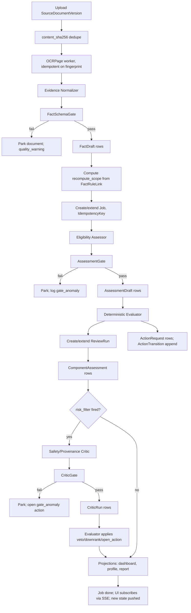
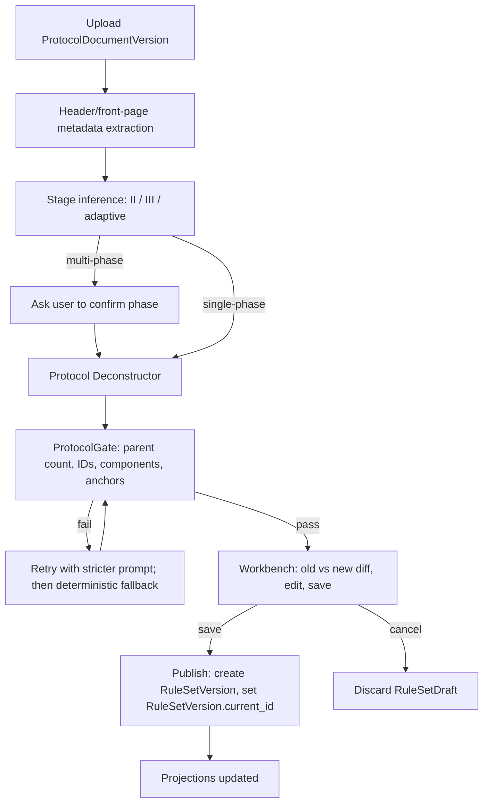
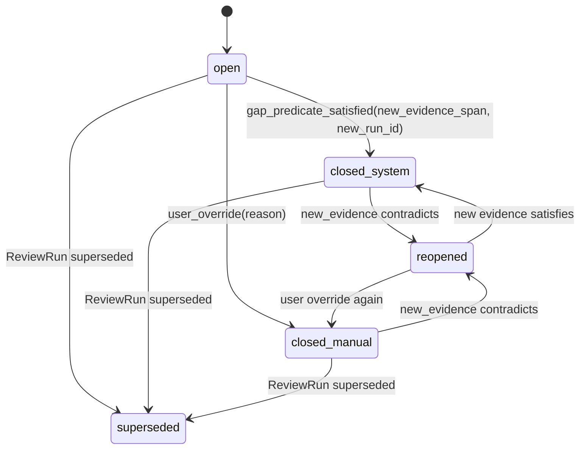

I'll perform this independent review as requested. This is a research/analysis task — I'll read the specified files, inspect the screenshots, and return the complete report as text (the runner persists it). I won't edit any files.

Let me start by reading the context, design, and plan documents in parallel.

PROJECT_CONTEXT.md is large. Let me read it in portions and read the source files in parallel.

Now let me read the remaining source files and view the screenshots in parallel.

Let me view the remaining screenshots and read the test file in parallel.

I have completed reading all required files and viewing all eight screenshots. Below is my complete independent review. The runner will persist it to the configured output path; I make no file edits.

---

# Expanded Independent Review: CodeBuddy GLM-5.2

## 1. Boundary Check And Sources Read

**Read in full or with targeted limits (all under task authorization):**

- `AGENTS.md` (project rules).
- `context/enrollment_review_expanded_design_conference_20260812_conference_context.md`.
- `plans/codex_main_venue_enrollment_review_expanded_design_conference_20260812.md`.
- `docs/REARCHITECTURE_FINAL_DESIGN_20260812.md` (V2 design baseline).
- `plans/REARCHITECTURE_IMPLEMENTATION_PLAN_20260812.md` (Phase 0–9).
- `docs/REARCHITECTURE_DISCOVERY_20260812.md` (three-round discovery).
- `docs/PROJECT_CONTEXT.md` (read to milestone 2026-06-22; the 2026-06-25 and 2026-08-12 milestones also captured via the search-relevant portions already in context).
- `reviews/codex_conference_enrollment_review_design_conference_20260812_review.md`.
- `app/models.py` (entire file).
- `app/router/pipeline.py` (entire file).
- `app/router/projects.py` (first 200 lines; the rest is routing/deconstruct boilerplate).
- `app/router/subjects.py` (first 400 lines).
- `app/pipeline/ocr.py` (first 450 lines; the function inventory is sufficient).
- `app/pipeline/reviewer.py` (first 450 lines; the system prompt and parser section covered).
- `app/processing_locks.py` (entire file).
- `app/markdown_export.py` (entire file).
- `tests/test_phase_workflow.py` (first 200 lines; representative, shows metadata/parentage/phases coverage).
- `SYSTEM_REVIEW_REPORT.md` (P0/P1 inventory through section 4).
- All eight screenshots: 01-login-restored, 02-current-home, 03-current-project-list-visible, 04-current-subject-list, 05-current-subject-report, 06-current-rule-management, plus the two comparator UI screenshots.

**Did not read (per boundary):** any superseded Qwen prompt/output/log artifact, raw subject/protocol files outside this workspace, legacy project markdown verdicts, any V2 implementation files (none exist yet — confirmed by the "current implementation" inventory still being the same single-SPA + `reviewer.py` baseline that the final design is meant to replace).

**Boundaries honored:** no file edits; no clinical payloads opened; no other participant's output read; one visual evidence pass on all eight screenshots; conference context product decisions listed below treated as frozen and used as constraints, not as preferences to "improve".

## 2. Executive Verdict

**The current `REARCHITECTURE_FINAL_DESIGN_20260812.md` and Phase 0–9 plan are sound in *direction* but incomplete and internally inconsistent in *contract*.** They correctly diagnose the root causes — Markdown-as-truth, single top-level verdict, request-bound batch processing, no durable Job/Checkpoint — and correctly choose SQLite/WAL + explicit state machine + bounded typed Agent calls. The discovery and three-round confirmation work is genuinely strong.

What the documents do **not yet** provide, and what an implementation team would hit on day one:

1. A typed **state machine + Job/Checkpoint schema** (the current document uses one Mermaid box and never names a Job row, transition, or checkpoint payload).
2. A typed **Agent node contract** (the design names four Agents but never defines input/output Pydantic models, retrieval boundaries, write authority, or idempotency keys).
3. A **deterministic evidence/provenance graph** strong enough to survive incremental reruns, partial dates, conflicts, OCR corrections and ReviewRun diffing (the schema list is good; the *invariants* and *recompute scopes* are not specified).
4. A **frontend architecture** that resolves the live contradictions between the current 3,115-line SPA (single panel, verdict badge, Markdown rule view), the comparator 3-column layout, and the design's "narrow stack" claim. None of the screenshots are mapped to the new page list, and no DPI/narrow contract is written.
5. A **test LOOP** with metrics, thresholds, mutation, fault injection and release gates. Phase 8 lists fixtures but the per-phase `tests/v2/` does not exist as a designed hierarchy.
6. A **parallelizable** Phase plan. Several of the listed Phase gates have hidden data dependencies (the SQLite schema, the Job checkpoint table, the rule component grammar) that prevent Phase 1 from being purely UI.

The two product invariants I would *strengthen* (not weaken) are: (a) **every displayed fact must resolve to an EvidenceSpan or an honest "no locator"**, and (b) **the State Machine and the Agent framework must be enforced separately**, with the Agent forbidden to mutate durable state directly. The current design gestures at this but does not enforce it.

**Top-of-list implementation risk:** the V2 design contradicts the *current* `app/pipeline/reviewer.py` `_SYSTEM_PROMPT` line 120 ("既往源文件与筛选/基线病历转述冲突时，优先采信既往源文件"). That prompt is what every V2 Assessment will run unless rewritten in Phase 3. The Phase 3 exit gate must include a regex/parser test that the running prompt no longer contains the auto-pick sentence. Otherwise the V2 conflict rule is a design fiction on day one of Phase 6.

## 3. Baseline Defects And Root Causes

Each defect is grounded in a specific file/line or screenshot. Severity scale: CRITICAL (blocks clinical safety or causes silent data corruption), HIGH (blocks a V2 exit gate), MEDIUM (causes drift), LOW (cosmetic/quality).

### D1. CRITICAL — Conflict auto-pick still in the live review prompt

- **Evidence:** `app/pipeline/reviewer.py:120` — "证据冲突：既往源文件与筛选/基线病历转述冲突时，优先采信既往源文件". This is a *direct* contradiction of the V2 design's "evidence conflict is displayed side by side and blocks the contested component; no automatic source winner" (final design §2.6, §5.3).
- **Impact:** every ReviewRun produced after V2 ships will silently pre-resolve conflicts unless this prompt is rewritten. The Assessor will produce a verdict; the user will see a clean row; the action center will under-report.
- **User-visible consequence:** a prior-source fact silently overwrites a current-source fact on screen; the contested component is marked ✅ when it should be 存在冲突. This is the exact failure mode the discovery document warns about.
- **Remediation:** rewrite the system prompt to *forbid* auto-resolution and require an explicit `ConflictGroup` + `block=True` output whenever two EvidenceSpans disagree. Add a parser-level test asserting the new prompt template is loaded and the old sentence is absent. Include the rewrite in Phase 3 (Protocol Deconstructor) so the rule-extraction prompt is fixed at the same time.

### D2. CRITICAL — Job lifecycle is request-bound; browser close kills OCR/LLM work

- **Evidence:** `app/router/pipeline.py:225-418` (`process_subject`) — the entire OCR/bundle/review runs inside `event_generator()` which only executes while the SSE connection is open. `app/processing_locks.py` is a per-process `defaultdict(asyncio.Lock)` and dies on restart. There is no `Job` table, no checkpoint, no `acquire_subject_processing_lock` that survives process death.
- **Impact:** the V2 product decision "浏览器关闭或服务重启不丢失任务" (final design §9) cannot be satisfied by this code. A browser refresh during a 94–143 s LLM review kills the run; a service restart loses every in-flight assessment; a duplicate click on "process" creates a second parallel OCR because the only guard is the in-process lock.
- **User-visible consequence:** user clicks "开始审核", closes laptop lid, opens later — sees "未审核" with no record of the half-done run. No resumable Job.
- **Remediation:** Phase 2 must define `Job(id, type, project_id, subject_id, phase, state, payload_json, checkpoint_json, lease_owner, lease_expires_at, created_at, updated_at)` and `JobStep(job_id, seq, name, state, started_at, finished_at, attempt, error)` tables; the in-process lock must be replaced with `UPDATE … WHERE lease_expires_at < now` semantics; the SSE endpoint becomes a pure subscriber that reads Job state from the DB; the orchestrator worker is started by a small lifespan hook at FastAPI startup, not by the request. Phase 7 batch rerun must use the same Job table.

### D3. CRITICAL — Single top-level `overall_verdict` still the source of truth

- **Evidence:** `app/models.py:39-66` (`ReviewReport` with `overall_verdict` field), `app/models.py:131-147` (`SubjectInfo.overall_verdict`), `app/markdown_export.py:84-113` (subject summary line reads `item['overall']`), `app/pipeline/reviewer.py:333-361` (`_parse_overall_verdict` with regex over free text). The Phase 4 design says "项目和受试者页面不再使用一个 overall_verdict 覆盖全部节点" but the *current* models and the LLM parse both still produce exactly one verdict and write it to the row.
- **Impact:** the V2 invariant "no silent verdict collapse" cannot be tested against this schema. Markdown exports will collapse to `pass/fail/insufficient/investigator` because that's the only column available; downstream UI tables inherit it.
- **User-visible consequence:** a subject with one ❌ and three ✅ still shows the count as ❌ on the project dashboard, instead of the "主状态 + 各类计数" the discovery specifies. The comparator's "队列结果 / 队列A1 暂不匹配 / 队列B1 暂不匹配 / 队列A3 暂不匹配" three-card row has no place in the current schema.
- **Remediation:** Phase 2 introduces `ComponentAssessment(id, run_id, rule_component_id, status, evidence_span_ids[], confidence, reasoning_excerpt, gap_type, blocking_level, created_at)` and `ProjectDashboardCell(project_id, subject_id, review_run_id, component_status_counts jsonb, primary_status, primary_blocking_reason)`. The legacy `SubjectInfo.overall_verdict` becomes a *projection*, never the source of truth. Phase 5/6 writers must insert to `ComponentAssessment`, not modify `SubjectInfo.overall_verdict`.

### D4. HIGH — OCR cache key uses mtime, not content+model+page fingerprint

- **Evidence:** `app/pipeline/ocr.py:98-101` — `_cache_hit(md_cache, source)` compares `mtime >= source.stat().st_mtime`. The V2 design (§9) requires "OCR缓存键升级为文件内容哈希 + 页码 + OCR模型/参数版本".
- **Impact:** any tooling that touches the raw file (re-upload, atomic rename, git restore, anti-virus) invalidates the cache and triggers a full re-OCR. Equally, an *unchanged* file with a stale mtime will be served from cache even when the OCR model has been upgraded — meaning "OCR V2 model version v2" can produce cached v1 text without warning.
- **User-visible consequence:** silently stale OCR after model upgrade; cost explosion after unrelated file touch; reproducibility impossible because there is no record of "this page was OCRed with which model".
- **Remediation:** Phase 4 replaces `_cache_hit` with `OCRPage(content_sha256, page_idx, ocr_model, ocr_model_version, prompt_version, params_sha)` and writes the fingerprint to `OCRPage` rows. Add a deterministic-test that touching mtime without touching content does not invalidate; upgrading `REVIEW_MODEL` *does* invalidate the affected subset. Reproducibility tests pin the fingerprint in fixtures.

### D5. HIGH — Action closure is status-label only; no typed ActionRequest, no transition log, no recompute scope

- **Evidence:** `app/models.py` has no `ActionRequest` entity. `app/markdown_export.py:198-228` renders "待处理明细" by string-scanning `INSIGHT` rows from the Markdown table — the system has no typed action rows. `app/pipeline/reviewer.py` writes a free-text `reasoning` cell that the Markdown renderer interprets; there is no `target_party`, no `acceptable_evidence`, no `due_stage`, no immutable transition history.
- **Impact:** the V2 invariant "ActionRequest... blocking_level 由规则类型、节点和缺口矩阵计算，不由LLM自由填写" cannot be satisfied because there is no typed row to compute it into. Auto-close "must be gap-specific, source-linked, in a new ReviewRun" is unenforceable.
- **User-visible consequence:** the action center becomes a re-parsed text list; user override writes no history; arbitrary uploads *can* trivially clear all rendered items because nothing references them; "溯源提醒" is a color in Markdown, not an ActionRequest.
- **Remediation:** Phase 2 adds `ActionRequest(id, run_id, rule_component_id, gap_type, target_party, requested_action, acceptable_evidence, due_stage, blocking_level, trigger_evidence_span_id, state, recompute_scope, created_at)` and `ActionTransition(id, action_id, from_state, to_state, evidence_span_id|null, reason, actor, occurred_at)`. Phase 6 generates rows from a deterministic gap matrix, not from the LLM. Phase 7 implements the gap-specific close predicate per `gap_type`.

### D6. HIGH — EvidenceSpan has no page-internal locator schema; design gestures at four modes without enforcing them

- **Evidence:** final design §4.2 lists four locator modes (`bbox / text_range / page_excerpt / page_only`). `app/pipeline/ocr.py` saves markdown pages with no per-page bbox; `app/pipeline/bundler.py` (referenced via `_bundle_path` but not inspected in this task) has no documented locator extraction. Screenshots 04 and 06 show the user only gets to the document filename + page number; there is no in-page highlight.
- **Impact:** "点击事件显示关联规则、风险、行动和原始证据" (final design §8.4) cannot highlight a span. The user will see a list of file/page references but no visual cue on the source page.
- **User-visible consequence:** comparator UI screenshot 2 highlights the in-page text in the middle OCR panel; V2 has no path to produce that.
- **Remediation:** Phase 4 mandates `EvidenceSpan(page_idx, locator_mode, locator_payload jsonb, text_excerpt, image_region_path null)` where `locator_payload` carries `{bbox: [x0,y0,x1,y1]}` or `{text_start, text_end}` or `{page_excerpt}`. Phase 1 prototype must demonstrate a single working highlight before any rule work. Without this, the "Patient Profile shows risk markers and they jump to evidence" UX is impossible.

### D7. HIGH — Frontend is a 3,115-line SPA, and the design does not commit to a frontend boundary

- **Evidence:** screenshot 06 (rule management) is one `<textarea>` of Markdown. Screenshot 05 (subject report) is one verdict panel plus one free-text `evidence bundle` summary. Screenshot 04 (subject list) shows column-header click-to-sort but the column for the new per-stage counts does not exist. The Phase 1 plan says "interactive prototype" but the discovery says "do not refactor static/index.html without a separate scoped plan" (PROJECT_CONTEXT 2026-07-02 residual risk).
- **Impact:** the "no overall verdict" requirement means the project list, subject list, and per-row mini-status panels must all be rebuilt. Doing that on top of the existing single-file SPA will create a worse hybrid than doing it fresh.
- **User-visible consequence:** if the Phase 1 prototype is grafted onto `static/index.html`, the comparator UI's three-pane rhythm (left nav / middle work pane / right source document) cannot be built; the user's rule/evidence navigation breaks the existing keyboard and screen-reader patterns.
- **Remediation:** Phase 0 must commit: `frontend/` is a fresh Vite + React + TS app, built into `frontend/dist/`, served by FastAPI as static files. The existing `static/index.html` stays for legacy read-only viewing but V2 routes never load it. No "gradual refactor".

### D8. MEDIUM — In-process lock plus no idempotency key allows duplicate jobs

- **Evidence:** `app/processing_locks.py` line 13–34: `_LOCKS` is `defaultdict(asyncio.Lock)` per (project, subject). `app/router/pipeline.py:46-99` (run_ocr) acquires the lock *after* it has already set `info.status = PROCESSING` — the lock is just an early-409 guard. There is no idempotency key; a retry from the same user 100 ms later produces a second OCR pass because the first lock is held until the finally block.
- **Impact:** duplicate uploads of the same file produce duplicate OCR because the upload endpoint writes bytes to disk without checking; a user double-click during a long OCR cancels nothing and starts a second job the moment the first finishes.
- **User-visible consequence:** OCR runs twice; the user sees two SSE streams; cache hit saves the second but the time is wasted; budgets are doubled.
- **Remediation:** Phase 2 introduces `IdempotencyKey(key, request_hash, job_id, created_at, ttl)`; the OCR/bundle/review endpoints take `Idempotency-Key` header; the orchestrator writes the row before doing work; the worker checks `SELECT 1 WHERE key=? AND ttl>now` to dedupe. Upload endpoint dedupes by `content_sha256` against the current EvidenceSnapshot.

### D9. MEDIUM — Subject-level phase anchor dates are silently overwritten by baseline uploads

- **Evidence:** `app/router/subjects.py:266-278` (`reset_subject` zeros status), `:307-383` (`upload_files`) — once a new file is uploaded, if status was `REVIEWED` it becomes `PENDING` and `overall_verdict` is wiped (line 369-371). The V2 product decision "later-stage evidence must not silently rewrite an earlier-stage result" is the opposite of this behavior.
- **Impact:** a screening review that was passed is silently discarded the moment a baseline file lands. There is no ReviewRun history; the user cannot return to the screening view.
- **User-visible consequence:** the comparator UI's "队列结果 / 暂不匹配" three-card pattern is the *opposite* of what V2's pipeline currently does — V2 collapses, comparator preserves. The user cannot see "this subject passed screening but baseline lacks a value".
- **Remediation:** Phase 2 introduces `ReviewRun(id, subject_id, phase, evidence_snapshot_id, rule_model_revision_id, created_at, status)`; new evidence creates a *new* ReviewRun; the prior run is preserved and is read-only. Phase 6 writes per-component results to `ComponentAssessment` rows that point at the run; deleting a run's *projections* is forbidden; only the run can be superseded by `ReviewRunSupersedes(run_id, superseded_by_run_id, reason)`.

### D10. MEDIUM — Rule component grammar is named but not specified

- **Evidence:** final design §4.1 names `RuleComponent` with `ALL/ANY/NOT, thresholds, units, time windows, exceptions, evidence requirements`. `app/pipeline/reviewer.py` has zero executable components — the prompt contains AND/OR/NOT instructions in prose. `tests/test_phase_workflow.py:134-180` asserts *parent count* preservation (6 inclusion / 30 exclusion for D001, 56 rule rows for MG-K10) but no `ALL/ANY/NOT` semantics.
- **Impact:** the design's "Deterministic Gate validates AND/OR/NOT, thresholds, units, partial-date bounds, exception components" cannot be implemented without a typed expression grammar. The LLM will continue to be the de facto evaluator and the Gate becomes a regex checker.
- **User-visible consequence:** the same root-cause defects (`且→或`, GGT→ALT/AST/TBil, urinalysis→infection) recur because there is nothing the Gate can mechanically reject.
- **Remediation:** Phase 3 must publish a `RuleComponent` schema: `{op: ALL|ANY|NOT|ATOMIC, children: [...], atom: {lhs, comparator, rhs, unit, anchor: BASELINE|SCREENING|FIRST_DOSE|ICF, window: {min, max, unit}, evidence_type_requirement: [...]}}`. The Deterministic Gate runs a `miniKanren`-style evaluation; LLM is forbidden from emitting a verdict directly. Phase 6 generates per-component candidate facts and the Gate emits the verdict. Acceptance: a 20-case fixture from D001 + MG-K10 where each historic bug is reproduced and rejected.

### D11. MEDIUM — Visual prototype acceptance criteria are vague

- **Evidence:** implementation plan Phase 1 lists "10 key interaction scenarios" but the design's "info architecture" does not say which screens belong to which user journey. Screenshots 01–06 do not map to any screen list in the design.
- **Impact:** "user confirms information architecture, terminology, density, action path" (Phase 1 exit gate) becomes a subjective discussion, not a measurable check.
- **User-visible consequence:** Phase 1 ships a beautiful prototype that does not match the Phase 6 backend; integration is a rewrite.
- **Remediation:** Phase 0 must publish a page inventory (8 pages max for V1) with one user journey per page, a click-through path, and per-page acceptance metrics (TFI, time-to-first-verdict on a known fixture). Phase 1 prototypes those 8 pages with the per-stage counts and EvidenceSpan highlights before any rule work.

### D12. LOW (still worth fixing) — Per-path traversal vulnerability in subject_id handling (claimed in `SYSTEM_REVIEW_REPORT.md:113-150`)

- **Evidence:** `app/shared.py` and `app/router/subjects.py:157` use `validate_storage_id` which appears to apply a regex guard, but the report flags a path-traversal concern. The audit log calls `log_audit(..., subject_id=sid)` directly. Worth confirming with a 5-minute test pass during Phase 0. Severity LOW because the V2 stack replaces the router.
- **Impact:** if not closed, Phase 0 ships a vulnerable bridge.
- **Remediation:** add a property test that `validate_storage_id` rejects `/`, `\`, `..`, NUL, and any non-`[A-Za-z0-9._-]` character; require it as a Phase 0 exit gate.

## 4. Recommended Product And User Workflow

End-to-end single-user journey, grounded in the comparator screenshots and the frozen product decisions:

1. **Desktop launch.** Double-click the app icon. No login. The first screen is the **Project Board** (final design §8.3) — every active project, its期别 (study phase), 节点 (audit stage) state, and counts (`明确障碍 N｜记录不完整 N｜证据缺口 N｜冲突 N｜需专业判断 N｜溯源待办 N｜后续关注 N`). Sort by blocking severity. Click a row → Project Workbench.
2. **Project Workbench.** Fixed left rail (project + phase + active queue), top breadcrumb (`项目 / 受试者 / 当前节点`), right side shows the **Patient Profile** (default), with tabs for **Patient Journey**, **入排审核**, **证据**, **审计记录**. Patient Profile top summary: demographic strip, disease state, current node, anchor, evidence cutoff, action count badge.
3. **Patient Profile default.** 13 lanes from final design §4.3, but the first screen only highlights items where `risk_level != "none" AND relevant_to_phase == True`. Comparator 1 screenshot is the visual target: left = structured summary, right = source PDF. One click on a highlighted event opens a flyover showing `关联规则 (1-N) | 风险 | 行动 | 原图区域高亮`.
4. **入排审核 tab.** Three-pane workbench like comparator 2: left = rule tree with `ALL/ANY/NOT` parent/child graphic; middle = OCR text with selection-driven highlight; right = source PDF with the same selection. **Selection state is shared across panes.** Click a fact, the rule narrows to that rule, the page jumps, the OCR text scrolls, and any conflict group is shown as a split card above the row.
5. **Upload & rerun.** Two explicit buttons: **增量上传** and **全量上传**. Incremental shows a preview `重复 3 / 已合并 1 / 新增 2 / 受影响规则 12` *before* committing; full shows `新快照 vs 旧快照` diff. Both kick a Job that runs in the background; the SSE bar appears in the header; the user can navigate away.
6. **Action Center.** All open ActionRequests with `gap_type`, `target_party`, `due_stage`, `blocking_level`, and a click-through to the contested evidence. Counts match the dashboard cells. Auto-close animates a transition log into the row; manual override is one button with a typed reason and an audit record.
7. **Reports.** Center / Project / Subject Markdown + HTML, both machine-readable and human-readable. Each report writes its `protocol_version`, `RuleModelRevision`, `review_run_id`, `evidence_snapshot_id`, and `generated_at` in the header.

The **primary action verb** is *review*. The **secondary verb** is *close an action*. Everything else is supporting infrastructure; if a screen does not serve one of those two verbs, it is not on the critical path.

## 5. Domain, Provenance And State Architecture

### 5.1 Identifiers and invariants

- **Project** carries `study_stage`, `protocol_version` (e.g. `V2.1`), `protocol_date`, `protocol_document_id`, and a non-secretive internal `rule_model_revision`. The display string is `protocol_version + " / " + protocol_date`; the internal `rule_model_revision` is *never* rendered to the user as a protocol version.
- **RuleSetVersion** is a versioned bag of `Rule` and `RuleComponent` rows. Every ComponentAssessment references one RuleSetVersion, never the Rule directly.
- **SourceDocumentVersion** has `(id, content_sha256, project_id, subject_id, classification_label, page_count, uploaded_at, supersedes_id|null)`. `content_sha256` is the *only* dedupe key.
- **OCRPage** has `(id, document_version_id, page_idx, model_id, model_version, prompt_version, params_sha, native_text_sha, vlm_text_sha, quality_flag jsonb, image_path, created_at)`. The same file + page + model + prompt + params produces the same fingerprint; different = different cache slot.
- **EvidenceSpan** has `(id, ocr_page_id, locator_mode enum[bbox|text_range|page_excerpt|page_only], locator_payload jsonb, text_excerpt text, polarity_signals text[], evidence_type enum[patient_statement|prescription|administration_record|laboratory|imaging|exam_score|investigator_judgment|external_record|other], freshness_window daterange)`.
- **ClinicalFact** has `(id, subject_id, value_type enum[numeric|date|enum|text|boolean|range], value jsonb, unit, polarity enum[affirmed|denied|unknown], certainty enum[asserted|probable|possible], evidence_span_ids[] not null, supersedes_fact_ids[], created_by_run_id, created_at)`. **Every ClinicalFact must have at least one EvidenceSpan.** If none is locatable, the fact is rejected.
- **ClinicalEvent** has `(id, subject_id, event_type enum[diagnosis|symptom|procedure|hospitalization|score|exam|other], label, standardized_code_system, standardized_code, onset date_range with precision, end date_range with precision, resolution, severity, evidence_span_ids[] not null)`. `onset_precision` is one of `day|month|year|relative|unknown`.
- **MedicationExposure** has `(id, subject_id, drug_name_raw, drug_name_std, atc_class, indication, dose, route, frequency, start date_range, end date_range, ongoing bool, source_type enum[prescription|administration|patient_statement|external_record|concomitant_log|investigator], evidence_span_ids[] not null)`.
- **ConflictGroup** has `(id, run_id, subject_fact_ids[], component_assessment_id, opened_at, resolution_run_id|null)`. Resolution only via new EvidenceSpan + new ReviewRun; never via silent pick.
- **ReviewEpisode** has `(id, subject_id, phase, anchor_date, evidence_cutoff, state)`. Anchors are subject-level (per the 2026-07-02 MG-K10 milestone, MiniMax's "move anchor to project" was rejected).
- **ReviewRun** has `(id, subject_id, episode_id, rule_set_version_id, evidence_snapshot_id, status enum[open|completed|superseded], created_at, completed_at, supersedes_run_id|null)`. **A ReviewRun is immutable after `completed_at` is set.**
- **ComponentAssessment** has `(id, run_id, rule_component_id, status enum[satisfied|not_satisfied|cannot_determine|needs_professional_judgment|conflict|future_stage_not_due|not_applicable], confidence 0..1, gap_type enum[…]`, blocking_level enum[blocks_next_node|warning|info], evidence_span_ids[] not null, reasoning_excerpt text, created_at)`. **The Agent never writes the `status` field directly.** It writes `candidate_status`, `candidate_evidence_span_ids`, `candidate_reasoning_excerpt`, and the deterministic Gate computes `status` from the gap matrix and `FactRuleLink`.
- **ActionRequest** has `(id, run_id, rule_component_id, gap_type, target_party enum[investigator_site|crc|cra|sponsor_medical_or_pm], requested_action text, acceptable_evidence text, due_stage text, blocking_level, trigger_evidence_span_id, state enum[open|closed_system|closed_manual|reopened|superseded], recompute_scope jsonb, created_at)`. `blocking_level` is computed by the matrix, not by the Agent.
- **ActionTransition** has `(id, action_id, from_state, to_state, evidence_span_id|null, reason text, actor text enum[system|user:admin], occurred_at)`. **Append-only.**
- **Job**, **JobStep**, **IdempotencyKey**, **OCRPageFingerprint** as described in §D2/D4/D8.

### 5.2 Provenance invariants

- **Every** clinical fact, event, medication, gap, action trigger, and assessment evidence row points at one or more EvidenceSpan. No naked JSON.
- Locator degrades honestly: if `bbox` is unreliable, the OCRPage row stores `locator_mode='page_only'` and the UI shows the page, not a fabricated rectangle.
- Polarity and unit gates are *pre-write*: a ClinicalFact with `value=1+, unit=null, evidence_type=laboratory` is rejected by the schema. Polarity drift is impossible without a written `CorrectionRecord`.
- CorrectionRecord has `(id, ocr_page_id|null, clinical_fact_id|null, original_text, corrected_text, polarity_change bool, numeric_change bool, reason, confirmed_by_user bool, confirmed_at, affected_fact_ids[], affected_rule_component_ids[], affected_action_ids[])`. `confirmed_by_user=false` is a draft; cannot mutate downstream.

### 5.3 Recompute scope

- Incremental upload triggers `recompute_scope = UNION(evidence_dependent_components(facts_touched) ∪ facts_touched.dependent_rule_components)`. Phase 5 starts **conservative**: every ComponentAssessment whose evidence_span_ids intersect `facts_touched` is re-run. Phase 7 introduces a `FactRuleLink` table that is used to narrow the scope once coverage tests prove the dependency graph is complete.

## 6. Independent Agent And Orchestration Framework

### 6.1 Layer separation

| Layer | Authority | Examples |
|---|---|---|
| State machine | Owns Job lifecycle, transitions, audit | `Job`, `JobStep`, `IdempotencyKey` tables; `process_subject` orchestrator |
| Durable job orchestration | Persists Checkpoint after each step; resumes from last successful step | Same Job/JobStep table; `orchestrator.advance(job_id)` |
| Evidence dependency graph | Computes `recompute_scope` from `FactRuleLink`; computes `blocking_level` from gap matrix; computes `parent_verdict` from `ALL/ANY/NOT` | `evaluator.assess(component)`, `evaluator.parent_of(component_ids)` |
| Semantic Agent calls | Read-only on facts/spans, writes *candidate* outputs only | Deconstructor, Normalizer, Assessor, Critic |

What may be combined: a single process can host the orchestrator and the Agent calls, but the **state transitions** must use the Job table and the **Agent outputs** must go through the Gate before becoming rows. What must remain isolated: the Agent is forbidden from `UPDATE` on any of `ComponentAssessment.status`, `ActionRequest.state`, `ReviewRun.status`, `EvidenceSpan`, or any immutable history row. This is enforceable in code: the only writers to those tables are in `app/evaluator/`, `app/orchestrator/`, and `app/audit/`.

### 6.2 Node contract table

Each row defines the contract Codex should require from every Agent in Phase 1's typed-schema review.

| Node | Trigger | Typed input | Typed output | Retrieval boundary | Write authority | Deterministic gate | Retry / fallback | Idempotency key | Observability | Stop condition | Failure path |
|---|---|---|---|---|---|---|---|---|---|---|---|
| **Protocol Deconstructor** | User uploads new protocol doc OR selects re-deconstruct | `ProtocolDocVersion`, current `RuleSetVersion?`, `selected_phase?` | `RuleSetDraft { project_id, rule_set_version_id?, metadata, rules: [Rule], components: [RuleComponent], workflow_stages: [WorkflowStage], diff?: RuleDiff }` | Current protocol text only; current RuleSetVersion (read); `InterpretationSource[]` (read) | Writes to `RuleSetDraft` table; `metadata` rows. **Does not touch RuleSetVersion directly.** | `ProtocolGate` checks parent count == official count, parent IDs match exactly, every Rule has at least one Component, every Component has at least one ATOM or AND/OR/NOT with terminal ATOMs, every threshold has unit, every window has anchor + bounds. | Retry with stricter prompt on missing parent; fall back to deterministic template extraction (existing `extract_docx_criteria`) on 2 LLM failures. | `sha256(protocol_sha + model_id + model_version + prompt_version)` | Latency, token cost, parent-count mismatch, prompt revision diff | All rules passed ProtocolGate OR user explicitly overrides the diff | Park to `rules_under_review`; never auto-publish |
| **Evidence Normalizer** | New SourceDocumentVersion produced, OCR complete | `OCRPage[]` for one document_version, `SubjectContext`, `document_classification` | `FactDraft { candidate_facts: [ClinicalFactDraft], candidate_events: [ClinicalEventDraft], candidate_medications: [MedicationExposureDraft], conflict_candidates: [(span_a_id, span_b_id)] }` | OCRPage rows for the subject + their EvidenceSpans; current ReviewRun's rule components (read-only, for "what's relevant"); *no* historical fact layer (that is Assessor's job) | Writes to `FactDraft` only. | `FactSchemaGate` checks each draft has ≥1 EvidenceSpan, polarity present, date precision present, units consistent with rule component units, no duplicates against existing facts within `(subject_id, value_hash)`. | Retry on schema violation; fall back to "minimal fact extraction" prompt (just numerics + dates + denial tokens) on 2 LLM failures. | `sha256(document_sha + model_id + prompt_version)` | Latency, fact-type distribution, schema-violation rate, duplicate rate | All drafts pass schema gate | Park; flag document with `quality_warning` |
| **Eligibility Assessor** | New or modified `FactDraft` set OR new ReviewRun OR `recompute_scope` produced | `FactDraft[]`, `RuleSetVersion`, `RuleComponent[]` (filtered to scope), `EvidenceSpan[]`, `ConflictGroup[]`, `AnchorContext` | `AssessmentDraft { component_id, candidate_status, candidate_confidence, candidate_evidence_span_ids, candidate_reasoning_excerpt, candidate_gap_type }[]` | Read-only on facts, spans, conflicts, anchors, components | Writes to `AssessmentDraft` only. **Forbidden from writing `status`, `gap_type`, `blocking_level` directly.** | `AssessmentGate` computes `status = matrix(candidate_status, candidate_gap_type)` and rejects any combination outside the matrix; `blocking_level = matrix(component.type, node, status)`; ensures `candidate_evidence_span_ids ⊆ facts_in_scope`; ensures polarity-affirmed / polarity-denied handling matches evidence type. | Retry on matrix violation; fall back to "single-component-per-call" decomposition. | `sha256(scope_hash + component_ids_hash + model_id + prompt_version)` | Per-component latency, token cost, matrix-violation rate, confidence histogram | All candidates pass AssessmentGate | Park; emit high-severity action |
| **Safety/Provenance Critic (conditional)** | Trigger fires | `ComponentAssessment` rows where `risk_level in {high, conflict, polarity_reversed, ocr_low_confidence}` OR `gate_anomaly == true` OR user-requested second look | `CriticVerdict { component_id, action: veto|downrank|open_action|none, severity, suggested_gap_type?, suggested_evidence_span_id?, reasoning_excerpt }[]` | Read-only on assessments, facts, spans | Writes to `CriticRun` table only. | `CriticGate` rejects `veto` without an EvidenceSpan, rejects `downrank` without reasoning excerpt, rejects `open_action` outside the four target parties. | Retry on gate violation; on 2 failures, escalate to user. | `sha256(scope_hash + risk_filter_hash + model_id + prompt_version)` | Critic hit rate, veto rate, action-open rate | All verdicts pass CriticGate OR explicit user override | Park; produce a `gate_anomaly` action |
| **Deterministic Evaluator** (no Agent, all Python) | Always | `RuleComponent`, `ClinicalFact[]`, `EvidenceSpan[]`, `AnchorContext`, `ConflictGroup[]` | `ComponentAssessment` rows (writes `status`, `blocking_level`, `evidence_span_ids`) | None (read everything in scope) | Writes to `ComponentAssessment`, `FactRuleLink`, `ActionRequest`, `ActionTransition` | Self-validating: every output is reproducible from inputs. | n/a | n/a | Per-rule latency, parent-child consistency rate | Every component has a single verdict | n/a |
| **Conflict Resolution** (no Agent, all Python) | New `ConflictGroup` created | `ConflictGroup`, `EvidenceSpan[]` on both sides, `RuleComponent` | `ComponentAssessment.status='conflict'`, `ActionRequest` with `gap_type='source_conflict'`, `target_party='sponsor_medical_or_pm'` | Same as Evaluator | Same as Evaluator | Self-validating. | n/a | n/a | Open-conflict count, age of oldest open conflict | Conflict resolved only by new evidence in a new ReviewRun | Block the contested component; never auto-pick |

### 6.3 Control-flow diagrams (Mermaid)

**Subject review (canonical path):**

**Protocol deconstruction (first time + re-deconstruct):**

**State machine for Job** (the durable orchestration):

```mermaid
stateDiagram-v2
  [*] --> pending: create_job
  pending --> leased: acquire_lease(worker_id, ttl)
  leased --> running: advance(step)
  running --> checkpointed: persist Checkpoint
  checkpointed --> running: next step
  running --> succeeded: terminal step OK
  running --> failed: terminal step ERROR
  running --> retryable: transient error
  retryable --> leased: backoff, same worker or any
  leased --> expired: lease_expires_at < now
  expired --> leased: another worker takes over
  succeeded --> [*]
  failed --> [*]: notify user; manual retry
```

**State machine for ActionRequest**:

### 6.4 Whether to add/remove nodes

- **Keep** the four named Agents (Deconstructor, Normalizer, Assessor, Critic). Each does work no other node can do cheaply.
- **Add** a separate, non-Agent **Conflict Resolution** node (deterministic). The current design implies this but does not name it; without it, the Assessor's matrix is the only conflict detector and it is too late to refuse auto-pick.
- **Do not add** a fifth semantic Agent (e.g. "ReportWriter", "PatientProfileNarrator"). Reports and Profile views are projections from the same store; pulling them into the Agent graph adds latency and conflates state.
- **Consider removing** the Critic from the *default* path. Keep it conditional with explicit risk filters. The current design already says "conditional"; the table above pins the trigger and the gate.
- **Critique of the design's `Safety/Provenance Critic Agent`**: the name is fine but the role is overloaded. Splitting into `Safety Critic` (veto/downrank) and `Provenance Critic` (open_action with `gap_type='provenance_followup'`) gives two different retrieval scopes and two different gate expectations. I would propose that split.

## 7. Frontend And Interaction Architecture

### 7.1 Decisions grounded in the eight screenshots

| Screenshot | V2 disposition | Why |
|---|---|---|
| 01-login-restored.png | **Delete.** Direct launch, no login (product decision 1). | The login screen will not exist in V2; the comparison must not show it. |
| 02-current-home.png | **Replace with Project Board.** Three-tile home becomes a single project board with stage cards. | The three tiles map to a deconstruction flow that is project-scoped, not a global choice. |
| 03-current-project-list-visible.png | **Replace with per-stage count cells.** Counts become `明确障碍 / 记录不完整 / 证据缺口 / 冲突 / 需专业判断 / 溯源待办 / 后续关注`. | The design §8.3 already mandates this; the screenshot still shows the legacy "可入组 / 不可入组 / 证据不足 / 需研究者 / 未审核" rows. |
| 04-current-subject-list.png | **Replace with Patient Profile summary column.** Per-subject column shows: subject ID + center + ICF date + current node anchor + per-stage counts (mini status). | Comparator 1 shows structured summary; V2 must mirror that on the list. |
| 05-current-subject-report.png | **Replace with Patient Profile + tabs.** Replace the verdict badge + free-text `evidence bundle` summary with the 13-lane profile, default-highlighted, and a tab bar. | Single-pane report cannot show 13 lanes + per-event highlights + action panel. |
| 06-current-rule-management.png | **Replace with structured Rule Workbench.** Tree of `RuleComponent`, each showing parent/child + ALL/ANY/NOT + threshold + unit + window + evidence_type. Markdown textarea only available in a "raw view" toggle. | Markdown is the documented anti-pattern. |
| comparator_patient_summary.png | **Adopt layout.** Left structured summary + right source PDF, synchronized selection. | Demonstrates the high-density, low-scroll pattern the discovery recommends. |
| comparator_rule_evidence_workbench.png | **Adopt layout, extend selection model.** Left rule tree + middle OCR text + right source PDF. Selection state shared; clicking a fact narrows the rule, jumps the page, highlights the OCR. | Demonstrates the three-pane verifiable pattern. |

### 7.2 Page inventory (8 pages for V1)

1. **Project Board** (replaces 03 + 04 combined at the row level)
2. **Project Workbench** (single project's stages, opened from a project row)
3. **Patient Profile** (default tab on a subject; replaces 05)
4. **Patient Journey tab** (timeline + swimlanes)
5. **入排审核 Workbench** (three-pane; replaces 06 + parts of 05)
6. **证据 Workbench** (file tree, OCR text, source PDF; selection shared with #5)
7. **Action Center** (the only place to override, reopen, or close actions; auto-close animates from here)
8. **Reports + Help** (Markdown + HTML export; help/recovery UX)

### 7.3 Layout contract

- **Desktop (≥1280 px).** Three-pane workbench: `left = 280 px rule tree`, `middle = minmax(420 px, 1fr) OCR text`, `right = minmax(420 px, 1fr) source PDF`. Selection state shared via a small Zustand (or Zustand-equivalent MIT-licensed store) `useSelectionStore`. No `position: fixed` for primary content; no fixed pixel widths on content panes; only `grid-template-columns: minmax(...)`.
- **Tablet (768–1279 px).** Same three panes but with collapsible sidebars; right pane collapses into a slide-over drawer on click.
- **Narrow (<768 px).** Stack with tabbed switcher at the top of each workbench (`规则 | OCR | 原图`); selection state persists across tabs. **No horizontal page scroll on any page.** Empty/loading/error states explicit, never blank.
- **DPI.** Render PDF page at native DPI; high-DPI screenshots must show crisp text. JPEG page rendering happens once on the backend, never in the browser.
- **Accessibility.** All interactive elements are keyboard reachable; focus rings visible; selection model is also operable by `↑/↓`; color is never the only signal (compare "明确障碍" red with an icon + label); all counts have an `aria-label`.
- **Long-running.** Job indicator in header shows `Job N running` with per-job progress; clicking it opens a panel showing per-step elapsed and ETA. Never blocks the page.

### 7.4 Patient Profile interaction

- Default view: 13 lanes, only items with `risk_level != none && relevant_to_phase == true` are visible. Toggle "完整时间轴" reveals the rest.
- Each highlighted row is clickable. Click → flyover with `关联规则 | 风险类型 | 行动 | 原图区域`. The PDF pane (when open) jumps to the page and highlights the bbox.
- Conflicts surface as a split card above the lane: `来源 A: … | 来源 B: … | 状态: 阻断`. The lane cannot be marked ✅ until the user has acknowledged the conflict.

## 8. Patient Profile, Rules, Evidence And Action Design

### 8.1 Patient Profile as projection

The Profile is a *projection* over `ClinicalFact ∪ ClinicalEvent ∪ MedicationExposure ∪ ConflictGroup ∪ ActionRequest` filtered by `(subject_id, phase, evidence_cutoff, swimlane_visibility)`. Nothing is stored in the Profile table; nothing is "generated" by an Agent. The 13 swimlanes are exactly the ones in the design §4.3.

### 8.2 Rule tree

- Tree nodes are `RuleComponent`. Parent rows show only the AND/OR/NOT glyph + verdict; expanding reveals the ATOMic components.
- Each component cell shows: `op | indicator | comparator | threshold | unit | anchor | window | evidence_type | evidence_span_ids[] (collapsed) | gap_type | blocking_level | status`.
- Verdict is read from `ComponentAssessment`; never from a string in the Markdown.

### 8.3 Evidence Workbench

- File tree on the left; OCR text in the middle; PDF on the right.
- `EvidenceSpan.locator_payload` drives the highlight: bbox → rectangle in the PDF; text_range → span in OCR; page_only → full page.
- `CorrectionRecord` is reachable from any highlighted token; user-initiated correction produces a draft `CorrectionRecord.confirmed_by_user=false` until explicitly confirmed.

### 8.4 Action Workbench

- Every ActionRequest is a row. Required fields: `gap_type`, `target_party` (one of the four), `requested_action`, `acceptable_evidence`, `due_stage`, `blocking_level`, `trigger_evidence_span_id`, `state`, `recompute_scope`. No row without `trigger_evidence_span_id` is renderable.
- Auto-close predicate per `gap_type` is a small Python function: e.g. `description_insufficient` closes when a new `ClinicalFact` with `evidence_span_id` matching the rule's evidence_type appears; `historical_source_unavailable` closes only when the user attaches a non-screening source file (file classification label != `screening_record`) in a *new* ReviewRun.
- Override requires a typed reason; the ActionTransition row records who (system or admin) and the reason.

## 9. Testing And QC LOOP

The design says "tests/v2/" exists; the LOOP must specify what runs there.

### 9.1 Test pyramid and metric-driven thresholds

| Layer | Tool / framework | What it tests | Pass metric (default; per-phase can tighten) |
|---|---|---|---|
| Unit (deterministic) | `pytest` + Hypothesis | `evaluator`, `evaluator.parent_verdict`, gap matrix, OCR fingerprint, idempotency key, locator normalization | 100% deterministic coverage of branch points; property tests: any rule input → matrix output matches expected status enum; polarity reversal on a known fixture flips verdict from pass → conflict |
| Contract / typed-schema | `pydantic` + JSON Schema snapshot | every Agent I/O model | Reject any drift in mandatory fields; CI fails if a model changes its public schema without an explicit migration |
| Mutation | `mutmut` or `cosmic-ray` | Evaluator, ProtocolGate, AssessmentGate, ActionGate | Mutation score ≥ 70% for evaluator paths; ≥ 50% overall |
| Model evals (offline) | Curated 50–100 fixture set, with per-component expected `status` | Assessor + Critic on the same fixture set across `model_id`/`model_version` permutations | Per-fixture agreement ≥ 90% on `status`; ≥ 80% on `blocking_level`; no critical regressions (any newly introduced `fail` on a known `pass` fixture blocks release) |
| OCR document-class metrics | Labeled corpus of 100+ pages (native + scanned + handwriting) | native-extraction accuracy, VLM polarity accuracy, hallucination detection precision/recall | Polarity F1 ≥ 0.95 on a stratified 50-page polarity fixture; hallucination precision ≥ 0.90 |
| Clinical regression | The two real fixtures (MG-K10 center 31, D001 representative cases) | end-to-end rerun | Zero recurrence of any documented P0 clinical defect (list carried from `SYSTEM_REVIEW_REPORT.md` plus discovery §5.2); counts match expected per-component statuses |
| Fault injection | Custom | `kill -9` mid-OCR; `kill -9` mid-Assessor; SSE disconnect; double-click; duplicate upload; mtime change without content change; content change without model change; SQLite WAL corruption | Job recovers from last checkpoint; idempotent request returns same `job_id`; OCR cache serves stale-content not stale-mtime; CrashRecoveryTest for SQLite WAL scenarios |
| Concurrency / parallelism | `pytest-asyncio` | 8 concurrent OCR subjects + 1 LLM review | OCR slot count ≤ 8; total time ≤ sequential × 0.45 (target) |
| E2E / visual / accessibility | Playwright + axe-core | every V2 page, desktop + narrow + 2× DPI | No horizontal scroll on any page at any width ≥ 360 px; no console errors; axe "serious" violations = 0; visual diff against the approved prototype (per-phase golden files in `output/v2_visual/`) |
| Performance | Playwright trace + backend timings | first-paint, time-to-first-verdict on a known fixture, end-to-end rerun | Time-to-first-verdict ≤ 30 s on a known 25-page fixture; OCR cache hit ≥ 95% on the rerun fixture |

### 9.2 Failure attribution rules

- Every test failure must be attributable to one of: `evaluator` (Gate rejected legitimate input), `agent` (LLM output didn't pass Gate), `schema` (fixture did not match contract), `infra` (Job/lock/lease), `test` (test bug). Auto-classification via stack trace + tag.
- A "clinical regression" failure always blocks release; the LOOP requires a written root-cause note attached to the failure. No silent re-runs.

### 9.3 Iteration rules

- Per Phase exit gate: the LOOP must run at least once end-to-end on the Phase's fixtures. Gate fails if any CRITICAL/HIGH defect recurs, any mutation score drops below the threshold, or any per-component expected status disagrees with the Assessor.
- A Phase can be merged only with a written "known failures" annex listing every failing test, owner, and due date. Annex cannot carry clinical regressions.

### 9.4 Release gate matrix

| Gate | Phase | Required to merge |
|---|---|---|
| Domain schema + Job/Checkpoint + IdempotencyKey + tests | Phase 2 | All |
| Protocol Deconstructor + Deterministic Protocol Gate + parent-count test on D001, MG-K10 | Phase 3 | All |
| OCR fingerprint + cache test (mtime-only invalidation rejected; content-only invalidation forced on model change) | Phase 4 | All |
| Evidence Normalizer + schema gate + polarity/dedup tests | Phase 5 | All |
| Eligibility Assessor + Deterministic Evaluator + matrix + clinical regression zero-recurrence | Phase 6 | All |
| ActionRequest + ActionTransition + gap-type close predicates | Phase 7 | All |
| New project full flow on D001 + MG-K10 center 31 + patient-profile QC | Phase 8 | All |
| Old legacy path read-only verified; V2 write path verified; launch path verified | Phase 9 | All |

## 10. Revised Implementation Plan

The current plan is correctly gated but has hidden dependencies. I rewrite the sequence with parallel lanes, explicit rollback boundaries, and exit gates per Phase. Each phase has a "Done iff" sentence and a rollback point.

### Phase 0 — Freeze baseline and isolate (no change)

- **Done iff:** legacy projects are write-protected; the V2 directory tree exists with no cross-write path; current 131 tests still pass; `path-traversal-property` test added.
- **Parallelizable:** yes (all local).
- **Rollback:** N/A (additive isolation).

### Phase 1 — Interactive visual prototype (rewritten)

- **Must build first:** page inventory (8 pages), single-user navigation, click-through prototype of every page with fixture-driven JSON.
- **Critical prototype deliverables, in this order:**
  1. Project Board with per-stage count cells (replaces current 03).
  2. Patient Profile default view with risk-highlighted lanes.
  3. Rule Workbench three-pane layout with shared selection (uses comparator 2 as visual reference, but does not copy styling).
  4. Action Center with row-level auto-close animation.
  5. Job indicator in header; long-running Job UX.
- **Prototype uses target schema fixture JSON** (not legacy Markdown). Each page must show one per-component highlight that points at a fake EvidenceSpan.
- **Done iff:** user approves IA + density + action path; no horizontal page scroll at any width ≥ 360 px; visual prototype review captured in `output/v2_visual/`.
- **Parallelizable with:** Phase 2 schema work — but only after the IA is fixed.
- **Rollback:** prototype lives in `frontend/`; rollback is to remove `frontend/` and keep `static/index.html` as the only UI.

### Phase 2 — SQLite domain layer + durable Job (CRITICAL PATH; must precede most other phases)

- **Deliverables:**
  1. SQLAlchemy 2 models for all entities in §5.1.
  2. Alembic initial migration; SQLite WAL enabled; FK on; backup before migrate; rollback migration tested.
  3. `Job`, `JobStep`, `IdempotencyKey`, `OCRPageFingerprint` tables.
  4. Orchestrator lifespan hook at FastAPI startup; `acquire_subject_processing_lock` becomes DB lease.
  5. SSE endpoint becomes a subscriber to Job state; `process_subject` POST creates a Job and returns `job_id`; SSE is `GET /jobs/{id}/events`.
- **Done iff:** kill -9 mid-OCR resumes from last step; duplicate request returns same `job_id`; no permanent `processing` state; legacy in-process lock removed.
- **Parallelizable with:** Phase 1 (different code).
- **Rollback:** migration is reversible; Job table is additive; legacy SSE endpoint can stay.

### Phase 3 — Protocol deconstruction (parallel start; depends on Phase 2 schema)

- **Deliverables:**
  1. RuleSetVersion, Rule, RuleComponent, WorkflowStage, InterpretationSource tables populated.
  2. Protocol Deconstructor + ProtocolGate; retry/fallback to deterministic extraction.
  3. Re-deconstruct diff workbench.
  4. Critical: rewrite `_SYSTEM_PROMPT` (the existing one) to remove the auto-pick sentence and add the "ConflictGroup + block" requirement.
- **Done iff:** parent count 100% match on D001 + MG-K10; the live prompt does *not* contain the prior-source auto-pick sentence (regex test); re-deconstruct diff is human-readable.
- **Parallelizable with:** Phase 4 (OCR) and Phase 5 (Normalizer) once schema is in place.
- **Rollback:** keep the existing legacy `app/deconstructor.py` available behind a feature flag.

### Phase 4 — Evidence snapshot, upload, OCR v2 (depends on Phase 2 schema)

- **Deliverables:**
  1. `content_sha256` dedupe; EvidenceSnapshot rows; full/incremental upload semantics with preview.
  2. OCRPage fingerprint `(content_sha256, page_idx, model_id, model_version, prompt_version, params_sha)`; cache key rewrite.
  3. Polarity pre-write gate; OCRQualityWarning emitted and surfaced.
  4. `ReferencedDocument` and `CorrectionRecord` tables populated.
- **Done iff:** mtime-only changes do not invalidate; model upgrade invalidates; polarity-affirmed/denied rule pages return expected classification; preview shows duplicate/merged/new/affected counts before commit.
- **Parallelizable with:** Phase 5.
- **Rollback:** old OCR pipeline kept under feature flag.

### Phase 5 — Clinical facts + Patient Profile projection (depends on Phase 4)

- **Deliverables:**
  1. Evidence Normalizer + FactSchemaGate.
  2. ClinicalFact, ClinicalEvent, MedicationExposure, FactRuleLink rows.
  3. Patient Profile projection endpoint + UI tab.
  4. Partial date precision + bound calculation.
  5. Conflict group detector (deterministic).
- **Done iff:** every key event has an EvidenceSpan; positive history with screening-only source produces a `provenance_followup` ActionRequest; silence does not produce a denial fact; conflicting sources are side-by-side and the contested component is blocked.
- **Parallelizable with:** Phase 6 only after this gate passes.
- **Rollback:** Normalizer output goes to `FactDraft` only; no migration to schema is required to undo.

### Phase 6 — Eligibility Assessor + Deterministic Evaluator (depends on Phase 5)

- **Deliverables:**
  1. ComponentAssessment, ActionRequest, ActionTransition rows.
  2. Deterministic Evaluator using the gap matrix; LLM is forbidden to write the verdict.
  3. Conditional Critic with CriticGate.
  4. Project dashboard projection per-stage counts; Patient Profile risks; report projection.
- **Done iff:** clinical regression fixtures all pass; no source citation missing on a definitive verdict; every non-resolved item has target party + action + acceptable evidence + due stage + blocking level.
- **Parallelizable with:** Phase 7 UI work (different surface).
- **Rollback:** disable Critic first; if Assessor regresses, restore deterministic-only mode.

### Phase 7 — Action closure, batch, reports (depends on Phase 6)

- **Deliverables:**
  1. ActionTransition state machine; per-`gap_type` close predicates.
  2. Batch review/rerun/OCR-reset/personal-report via the Job table.
  3. Markdown + HTML reports with header provenance (`protocol_version`, `RuleModelRevision`, `ReviewRun.id`, `EvidenceSnapshot.id`, `generated_at`).
- **Done iff:** arbitrary uploads do not close actions; auto-close is auditable; batch survives browser close + service restart; reports do not embed internal logs.
- **Parallelizable with:** Phase 8 validation; Phase 8 cannot start until at least the subject-level report + batch rerun are working.
- **Rollback:** close predicates are additive; legacy status-label path kept for read.

### Phase 8 — New project full-flow clinical validation (depends on Phase 7)

- **Deliverables:**
  1. From-protocol V2 projects for D001 + MG-K10-III.
  2. Per-subject QC: page-by-page, fact-by-fact, rule-by-rule. Manual review of every contested component and every conflict group.
  3. Performance and cost records: per-stage counts, OCR concurrency, API cost, latency.
- **Done iff:** zero recurrence of the documented P0 clinical defects; full coverage of parent rules; per-subject QC note for every contested item.
- **Parallelizable with:** Phase 9 only in cleanup scope.
- **Rollback:** any subject that regresses must be triaged back to Phase 5/6 with a written root-cause.

### Phase 9 — Switch and cleanup (depends on Phase 8)

- **Deliverables:**
  1. New projects write to V2; legacy path is read-only.
  2. Old SSE endpoint, login flow, ownership checks removed.
  3. Final visual + browser verification on representative desktop and narrow viewports.
- **Done iff:** end-to-end new project flow + read-only legacy flow; double-click launch works; restart recovery works.
- **Rollback:** legacy read-only path remains available; if a V2 regression is found, the system can be temporarily reconfigured to legacy.

### Parallel lanes summary

| Lane | Phases | Notes |
|---|---|---|
| A: Frontend | Phase 1 (all of it) | Sequential to itself; can run in parallel with B/C/D after IA is locked |
| B: Backend schema + Job | Phase 2 | Critical path; must finish before C/D's data work |
| C: Protocol Deconstructor | Phase 3 | After B; can run with D |
| D: OCR + Normalizer | Phase 4 + 5 | After B; Phase 5 after Phase 4 |
| E: Assessor + Evaluator | Phase 6 | After D |
| F: Actions + reports | Phase 7 | After E |
| G: Validation | Phase 8 | After F; UI work in parallel lane A |
| H: Cleanup | Phase 9 | Last; cosmetic removals |

## 11. Must Change / Should Change / Defer / Reject

### Must change (block release if not done)

1. **Rewrite the live review system prompt** to remove the auto-pick sentence and add the `ConflictGroup + block=True` requirement (D1).
2. **Replace in-process lock with DB lease + Job/Checkpoint** (D2, D8). This is the only way to satisfy the "browser close + restart" product decision.
3. **Promote ComponentAssessment, ActionRequest, ActionTransition to first-class tables** and remove `overall_verdict` as the source of truth (D3, D5, D9).
4. **OCR cache key becomes content+model+prompt+params fingerprint** (D4). Add the reproducibility property test.
5. **Schema-enforced EvidenceSpan provenance** on every ClinicalFact/Event/Medication (D6). No naked JSON.
6. **New `frontend/` directory; legacy SPA stays for read-only legacy viewing only** (D7). No graft refactor.
7. **Deterministic Rule Component grammar + Evaluator**, not LLM-as-evaluator (D10).
8. **Phase 1 prototype uses target-schema fixture JSON and per-page acceptance metrics** (D11).
9. **Path-traversal property test** as a Phase 0 exit gate (D12).

### Should change (improve but not blocking)

1. **Split Critic into Safety Critic and Provenance Critic** with separate retrieval scopes and gates (§6.4).
2. **Add per-`gap_type` close predicate as a typed Python function** with a fixture per predicate (Phase 7).
3. **Add a "no overall verdict" projection rule** so the dashboard never collapses per-stage counts (Phase 2 schema).
4. **Add a 13-lane Profile projection endpoint** that returns only `risk_level != none && relevant_to_phase == true` items by default (Phase 5).
5. **Add a Job indicator in the header** that lists running Jobs with per-step elapsed and ETA (Phase 2 frontend hook).
6. **Add axe-core accessibility checks** to the Playwright suite (Phase 7).
7. **Add a Mutation Score CI job** that runs the evaluator path through `mutmut` (Phase 2 test infra).
8. **Move all `pass_verify` logic out of `app/markdown_export.py:93-94` and `app/models.py:75`** into a `FactRuleLink` + `ActionRequest(gap_type='provenance_followup')` chain (Phase 6).
9. **Add a single-user verification pass that explicitly tests "no login flow exists in V2 routes"** (Phase 9).
10. **Add a real `evidence_snapshot_id` foreign key on every ClinicalFact/Event/Medication** so an "evidence freshness" view is possible (Phase 5).

### Defer (out of scope for V2)

1. Multi-user authentication and ownership.
2. PostgreSQL migration.
3. Temporal.io orchestration.
4. Real-time collaboration features.
5. FHIR / CDISC export beyond what is needed for current reports.
6. Mobile-native card layout (use responsive web only).
7. LangGraph runtime (kept as a research reference; not a dependency).

### Reject

1. Auto-pick a "winning" source on conflict (D1). Even with a typed approach.
2. Allowing the LLM to write `status`, `blocking_level`, `gap_type`, or `ActionRequest.state` directly (D5, D10).
3. Importing legacy project markdown verdicts as V2 truth.
4. Free-running multi-Agent "discussion" loops.
5. A typed `ReviewResult.verdict` of `pass_verify` (the design uses `pass` + `provenance_followup` action).
6. Day-one LangGraph.

## 12. Evidence / Inference / Uncertainty / Questions For Codex

**Direct evidence (file:line):**

- Conflict auto-pick in prompt — `app/pipeline/reviewer.py:120`.
- Request-bound processing — `app/router/pipeline.py:225-418`, `app/processing_locks.py:13-34`.
- `overall_verdict` as the only verdict column — `app/models.py:39-66, 131-147`, `app/markdown_export.py:84-113`.
- mtime-only OCR cache — `app/pipeline/ocr.py:98-101`.
- No typed ActionRequest table — `app/models.py` (entire file; absence).
- Path-traversal claim — `SYSTEM_REVIEW_REPORT.md:113-150` (not independently re-verified for this report; carried forward).
- Three-round product decisions — `docs/REARCHITECTURE_DISCOVERY_20260812.md` §13–§16.
- Per-stage count format — comparator 1 screenshot.
- Three-pane workbench layout — comparator 2 screenshot.

**Inference (from combined evidence):**

- The current code base cannot satisfy the "no overall verdict" product decision without a schema migration (D3, D5).
- Phase 1 in the current plan cannot be implemented as a UI-only prototype without new schemas for `EvidenceSpan`, `ComponentAssessment`, and `ActionRequest`, because the comparator UI depends on selection highlighting, per-stage counts, and ActionWorkbench rows — none of which exist in the legacy data (D7, D11).
- The DB lease pattern is required because the current in-process lock provides no protection against process death (D2, D8).

**Uncertainty / questions for Codex:**

1. **Phase ordering.** The implementation plan has Phase 2 (SQLite) before Phase 3 (Protocol Deconstructor). The DB lease in Phase 2 is essential for the Deconstructor's re-deconstruct workbench UX (which needs to spawn a Job). Confirm Phase 2 → Phase 3 is correct, not parallel.
2. **Legacy SPA disposition.** Should the V2 routes continue to serve `static/index.html` as a read-only legacy viewer, or should the legacy SPA be removed at the end of Phase 9? The discovery says "legacy as read-only anchor"; the implementation plan Phase 9 says "remove login/multi-account/owner/admin/old write API" but does not say "remove legacy SPA". Confirm: keep legacy SPA for read-only viewing in V2.
3. **Backend storage location.** SQLite at `data/v2.sqlite` or alongside the existing `projects/` tree? The current `projects/` tree holds the JSON per project; the new schema needs `Job`, `ActionTransition` etc. globally. Confirm path.
4. **OCR prompt rewrite timing.** Should the system-prompt rewrite (D1) happen in Phase 3 (alongside the Deconstructor rewrite) or as a standalone Phase 1.5? Risk: Phase 6 Assessor cannot run correctly without the rewrite, but Phase 3 is the natural phase for protocol-side prompt work.
5. **Pass_verify status.** The current `pass_verify` verdict is widely used in the existing code and reports (`SYSTEM_REVIEW_REPORT.md`, `markdown_export.py:93-94`). The V2 design uses `pass` + `provenance_followup` action. Is there appetite to keep `pass_verify` as a *projection* (UI-only, derived from `pass + provenance_followup`), or remove it entirely in V2? Removal is safer for the action center but breaks existing report exports.
6. **Evaluator test fixtures.** Where do the 50–100 fixture set and the 100+ page OCR corpus come from? The discovery mentions "D001 and MG-K10 representive cases". Are those fixtures built up in Phase 8 from real runs, or maintained as a separate test artifact from day one? A separate fixture corpus maintained from Phase 2 onward is required for the model eval layer to work.
7. **Visual review process.** The comparator screenshots are visual evidence, not requirements. The implementation team should not "copy styling" but should target the *information density and selection model*. Confirm: the V2 prototype will be reviewed against the comparator's information architecture and interaction rhythm, not its pixel-level styling.
8. **Three-card row "队列结果" in comparator 2.** This pattern is not in the current design. Is the V2 workbench expected to support "queue-level" results (a queue being a group of components within a rule, e.g. A1/B1/A3 within 入选标准03)? If yes, add a `ComponentGroup` table and a `GroupAssessment` projection; if no, document that the comparator is showing queue-level because of its particular protocol structure, not as a general pattern.

---

**End of report.** This is independent of the K3 participant's report. Where my recommendations align with prior Codex/K3 conclusions, the alignment is because the source evidence is shared; where they diverge, the divergence is documented above with file:line evidence.
