# Conference Participant Output: phase5-slice61af-independent-clinical-code-review-20260828 - general_pi_antigravity

## Boundary Check

- **Role & Participant**: `general_pi_antigravity` (Pi / `google-antigravity` / `gemini-3.7-flash` / `high` thinking effort), Participant 1 in Codex-chaired parallel conference.
- **Workspace Boundary**: Read-only inspection within the authorized workspace (`.worktrees/phase5-clinical-facts-profile`). No production paths read or modified.
- **Tool Usage & Mutation Policy**: Strictly read-only analysis using specialized tools (`read`, `grep`, `glob`, `bash` for deterministic pytest execution). No source files modified; no report file written directly via tool calls (leaving persistence to runner).
- **Clinical & Acceptance Authority**: Codex retains final clinical, regulatory, and architectural acceptance authority. Synthetic test passage is explicitly distinguished from clinical validity.

---

## Independent Work Product

本轮独立复核全面审查了 Phase 5.8d 病毒学（`body.p803`–`p805`）条件性豁免与同源候选定向修订的源码实现、合成测试、历史失败工件（v4/v5）及当前接受工件（v6）。从三个核心挑战角度提出独立审计结论与深度技术/临床评估：

```mermaid
flowchart TD
    subgraph S1 [视角 1: 豁免语义与过度证据门禁]
        A1[body.p804/p805 原文: 无需再次检查] --> B1[_EXEMPTION_MODALITY_RE 识别豁免语气]
        B1 --> C1[_check_mixed_decision_stage_control 排除豁免原子，防止误判为常规筛选操作]
        B1 --> D1[_check_conditional_exemption_binding 绑定前置28天有效条件]
        B1 --> E1[_check_exemption_evidence_modality 拦截反向无操作过度证据]
        E1 -.->|盲区发现| F1[Regex范围未覆盖'无/未二次/排除'及非豁免描述穿透]
    end

    subgraph S2 [视角 2: 同源多候选定向修订与位置机制]
        A2[单一来源 su-86389 拆为 2 个候选] --> B2[CANDIDATE_REPARTITION_GATE_CODES 授权 1->N 拆分]
        B2 --> C2[重分区通过: 形成 3 个工件候选]
        C2 --> D2[后续若单候选失败: 触发 mutable_candidate_indexes 定位]
        D2 -.->|高危缺陷| E2[同源候选位置调换可导致候选静默丢失/复制]
        D2 -.->|防护盲区| F2[_validate_bounded_output_repair 对同源候选全量放行检测]
    end

    subgraph S3 [视角 3: 真实 v6 工件保真度与去重]
        A3[v6 工件 3 个控制点] --> B3[Control 1: p805 补充检测 28d 有效期 + 3条触发分支]
        A3 --> C3[Control 2: p804 常规病毒学 28d 有效期 + 无需再次检查]
        A3 --> D3[Control 3: p804 增量三项 HBsAb/HBeAg/HBeAb 筛选期必做]
        B3 & C3 & D3 --> E3[通过 supplementary_requirement 链接流程第14项，去重 EX-22]
    end
```



---

### 1. 视角一：豁免语义与过度证据门禁审计

#### 1.1 代码是否真正防止把“无需再次检查”误判为必须执行的筛选操作？
**审计结论：是，代码已在语义分词、规划冻结与跨阶段门禁三个层级建立了完整的互斥隔离机制。**

- **规划层语义动作冻结**（`app/protocols/protocol_control_planning.py:40–46`）：
  `detect_required_action_kinds()` 通过 `preserve_exemption_condition` 规则，将包含“无需/不需要/不要求/可免”的文本识别为保留豁免条件，而非普通检查操作。
- **禁止事件强化拦截**（`app/protocols/protocol_control_gate.py:1739–1745`）：
  在 `_check_obligation_modality_and_event_anchor` 中，若模型将“无需检查”误定义为 `kind="prohibit_event"`，门禁即时抛出 `EXEMPTION_MODALITY_OVERSTATED`（*“无需或不要求执行表示豁免，不得强化为禁止事件”*），防止将临床豁免误判为研究禁忌。
- **常规操作与跨阶段混合排他**（`app/protocols/protocol_control_gate.py:2032–2046`）：
  在 `_check_mixed_decision_stage_control` 中，检测无锚点常规操作的关键逻辑为：
  ```python
  has_unanchored_routine_action = any(
      getattr(atom, "time_constraint", None) is None
      and _ROUTINE_ACTION_RE.search(atom_text)
      and not _EXEMPTION_MODALITY_RE.search(atom_text)  # <--- 显式排除豁免语气
      for atom in atoms
      for atom_text in [...]
  )
  ```
  该逻辑确保了当有效性判定（`time_constraint: first_dose_date -28d`）与豁免陈述（“无需再次检查”）同处于一个候选时，豁免语句不会被 `_ROUTINE_ACTION_RE` 误识别为当前筛选阶段必须执行的无锚点操作，从而避免了将“无需再次检查”错误撕裂并误判为独立筛选必做项。
- **同源条件绑定约束**（`app/protocols/protocol_control_gate.py:1757–1806`）：
  `_check_conditional_exemption_binding` 确保包含“可接受在首次给药前28天内的结果”的原文单元中，“无需再次检查”必须与前置时间条件（`timed_spans`）或触发条件（`trigger_spans`）绑定在同一语义范围内，防止豁免演变为无条件的免检放行（抛出 `CONDITIONAL_EXEMPTION_BINDING_MISSING`）。

#### 1.2 代码是否完整识别要求证明“未重复执行”的过度证据？
**审计结论：基本逻辑闭环，但存在 2 处边界漏检盲区（Regex 语法盲区与非豁免声明穿透）。**

- **当前实现**（`app/protocols/protocol_control_gate.py:1809–1839`）：
  ```python
  _EXEMPTION_NONOCCURRENCE_EVIDENCE_RE = re.compile(
      r"(?:未|没有)[^。；\n]{0,12}(?:再次|重复)[^。；\n]{0,24}(?:检查|检测|执行|操作|处置)",
      re.IGNORECASE,
  )
  def _check_exemption_evidence_modality(*, entity_id, obligation_expression, evidence):
      has_exemption = any(_EXEMPTION_MODALITY_RE.search(...) for atom in _iter_expression_atoms(...))
      if has_exemption and any(_EXEMPTION_NONOCCURRENCE_EVIDENCE_RE.search(str(getattr(item, "description", ""))) for item in evidence):
          _fail("EXEMPTION_EVIDENCE_OVERSTATED", "免予操作只需证明适用条件成立；不得要求证明被免予的操作未发生", entity_id=entity_id)
  ```
- **发现的漏洞与盲区 1（Regex 语法覆盖不全）**：
  `_EXEMPTION_NONOCCURRENCE_EVIDENCE_RE` 仅匹配前缀“未”或“没有”。若模型生成以下真实临床表述，门禁将**静默漏检**：
  1. “确认**无**重复采血记录” / “**无**再次化验单”；
  2. “受试者**排除**二次筛查记录”；
  3. “**未重新**采集血样”；
  4. 英文输入模式下的过度证据：`"absence of repeat viral screening"` / `"confirm no re-testing performed"`。
- **发现的漏洞与盲区 2（前置条件解耦导致的门禁穿透）**：
  `_check_exemption_evidence_modality` 的前置检查是 `if has_exemption:`（即义务原子中含有 `_EXEMPTION_MODALITY_RE`）。如果模型在修订时将义务 statement 净化为纯粹的“核对28天内化验单有效”，但却在 `minimum_evidence` 的 `description` 中写出“筛选期访视记录，确认未重复执行病毒学检查”，此时 `has_exemption == False`，导致**过度负向证据直接绕过门禁被放行**。

---

### 2. 视角二：同源多候选拆分与 Wire 定向修订机制审计

#### 2.1 候选重分区授权与 Bounded Restore 闭包
**审计结论：`slice61ab` 建立的门禁级重分区授权成功解决了跨阶段拆分候选丢失的根本冲突，但在同源单元多候选定位时存在底层脆弱性。**

- **通用重分区授权**（`app/protocols/protocol_control_repair_errors.py:17–28`）：
  定义了 `CANDIDATE_REPARTITION_GATE_CODES = frozenset({"ACTION_TARGET_SCOPE_MISMATCH", "MIXED_DECISION_STAGE_CONTROL", "MIXED_TRIGGER_DECISION_STAGES"})`，解除了旧版仅允许 `ACTION_TARGET_SCOPE_MISMATCH` 重分区的硬编码限制。
- **来源闭包保全机制**（`app/agents/protocol_control_deconstructor.py:2101–2142`）：
  在 `allow_candidate_repartition=True` 时，计算 `mutable_candidate_source_union`，允许 1 个来源单元产出 N 个候选，同时通过 `current_union == mutable_candidate_source_union` 强制检查，严禁范围外单元渗透或缺失。

#### 2.2 按 Wire 位置定向修订（`mutable_candidate_indexes`）的高危隐患
**审计结论：发现高危边界缺陷——同源多候选的索引对齐缺乏语义锚定，模型乱序输出会导致同源候选被静默覆盖、重复或丢失，且 `_validate_bounded_output_repair` 对此存在检测盲区。**

- **复现路径与机理**：
  1. 假设上一轮已成功从 `su-86389` 拆出 2 个候选：
     - `Index 0`: 候选 A（`su-86389`, 筛选期增量必做）
     - `Index 1`: 候选 B（`su-86389`, 基线 28d 有效性核对）
  2. 若在第 3 轮中，候选 B 触发了非重分区错误（如时间窗描述错误，`allow_candidate_repartition=False`）。
  3. Runner 将计算 `repair_candidate_indexes = {1}`，设置 `mutable_candidate_indexes = {1}`，`mutable_candidate_source_keys = {("su-86389",)}`。
  4. 进入 `_restore_bounded_wire_repair` 的 `elif mutable_candidate_indexes:` 分支（`app/agents/protocol_control_deconstructor.py:2143–2175`）：
     ```python
     for index, previous_candidate in enumerate(previous.candidate_drafts):
         if index not in mutable_candidate_indexes:
             candidates.append(previous_candidate)  # 取上一轮 Index 0 (候选 A)
             continue
         current_candidate = current.candidate_drafts[index]  # 取当前轮 Index 1
         if current_candidate.source_structure_unit_ids != previous_candidate.source_structure_unit_ids:
             raise ProtocolControlAgentWireValidationError(...)
         candidates.append(current_candidate)
     ```
  5. **错位风险**：如果模型在当前轮次返回时，将修改后的候选 B 放在了 `candidate_drafts[0]`，而将未修改的候选 A 放在了 `candidate_drafts[1]`：
     - 此时 `current.candidate_drafts[1]` 的 `source_structure_unit_ids` 仍然是 `["su-86389"]`，完全等于 `previous.candidate_drafts[1]` 的来源！
     - 来源检查 `current_candidate.source_structure_unit_ids != previous_candidate.source_structure_unit_ids` **直接通过**！
     - 结果：`candidates` 列表中加入了 `previous.candidate_drafts[0]`（候选 A）和 `current.candidate_drafts[1]`（候选 A）。
     - **后果**：候选 B 被**静默丢弃**，候选 A 被**重复装配**！
  6. **防护网失效（`_validate_bounded_output_repair` 盲区）**：
     在 `_validate_bounded_output_repair`（`app/agents/protocol_control_deconstructor.py:1918`）中：
     ```python
     candidate_is_mutable = source_units in mutable_candidate_source_keys ...
     ```
     由于 `mutable_candidate_source_keys` 包含了 `("su-86389",)`，系统认为所有来源为 `su-86389` 的候选全都是“可变的”，因此**候选 A 完全不会进入 `frozen_candidates` 比对集**！`_validate_bounded_output_repair` 对此错位事故**完全无感并判定放行**！

---

### 3. 视角三：真实 v6 工件保真度与去重审计

#### 3.1 三个控制点与原文（`body.p804`/`p805`）及关联上下文的映射矩阵

| 控制点 ID (v6) | 来源单元 | 决定阶段 | 核心义务与范围 | 关联关系与去重说明 | 忠实度与合规评价 |
|---|---|---|---|---|---|
| **Control 1** (`pcc-e04a6576be36dc2bec970fb3`) | `body.p805` (`su-3de4633dd1cb5721547f0bb2`) | `baseline` (flow-baseline) | 对 HBV-DNA、HCV-RNA、梅毒非特异性抗体三项补充检测核对首次给药前 28 天内有效；保留 3 个触发分支。 | `supplementary_requirement` 链接流程 14 项（`pcm-row-2a4db6b98190f7f0c22da3b3`）。不重复触发检查动作与排除阈值判定。 | **完全忠实**。正确将反射性检查的执行留在流程，仅补充 D1 前 28d 有效性约束。 |
| **Control 2** (`pcc-59d4b349ce2bfc570ea7156b`) | `body.p804` (`su-86389bb90acd044a0835089c`) | `baseline` (flow-baseline) | 核对常规病毒学检查结果在首次给药前 28 天内有效；筛选期/基线期无需再次检查。 | `supplementary_requirement` 链接流程 14 项。不重复筛选期抽血操作。 | **完全忠实**。准确表达 28 天内历史/筛选结果互认的豁免语义。 |
| **Control 3** (`pcc-136f6e944a758e942f4aa33b`) | `body.p804` (`su-86389bb90acd044a0835089c`) | `screening` (flow-screening) | 按标准实验室程序完成乙肝表面抗体、乙肝e抗原、乙肝e抗体三项新增检查。 | `supplementary_requirement` 链接流程 14 项。明确指出流程 14 项已覆盖其余 5 项（HBsAg, HBcAb, HCVAb, HIVAb, Syphilis特异性抗体）。 | **完全忠实**。精准识别出 `p804` 相比表 5 脚注 14 增补的“乙肝两对半”其余三项。 |

#### 3.2 流程第 14 项与 EX-22 的去重合规性检验
- **流程第 14 项去重**：表 5 脚注 14（`body.p328`）已定义筛选期常规 5 项及条件触发规则。v6 工件未重新建立常规 5 项的基础检查控制点，而是通过 `supplementary_requirement` 增量挂载“新增 3 项检查”与“28 天有效窗”。
- **EX-22 去重**：EX-22（`body.p685`–`p689`）是排除标准，定义了病毒载量上限与研究者治愈判定。v6 工件的 3 个控制点中，未出现任何 `kind: prohibit_event` 或将感染界值复制为控制点义务的情况，完全避免了与 EX-22 的规则重叠。
- **研究者判断与非特异性抗体**：EX-22 包含梅毒治愈判断；v6 Control 1 的最低证据仅要求带有日期的实验室检测报告（`lab_report_with_date`），未强加“无梅毒感染证明”或“未重复抽血记录”，符合最低必要证据原则。

---

## Evidence And Assumptions

### 1. 核心代码与测试证据
1. `app/protocols/protocol_control_repair_errors.py` (L17–28, L40–75):
   - 证实 `MIXED_DECISION_STAGE_CONTROL` 与 `MIXED_TRIGGER_DECISION_STAGES` 已纳入 `CANDIDATE_REPARTITION_GATE_CODES`。
2. `app/protocols/protocol_control_gate.py`:
   - L271–284: `_EXEMPTION_MODALITY_RE`, `_CONDITIONAL_EXEMPTION_SOURCE_RE`, `_EXEMPTION_NONOCCURRENCE_EVIDENCE_RE` 正则定义。
   - L1740–1745: `EXEMPTION_MODALITY_OVERSTATED` 拦截将豁免写为禁止事件。
   - L1757–1806: `CONDITIONAL_EXEMPTION_BINDING_MISSING` 拦截豁免与前置条件脱钩。
   - L1809–1839: `EXEMPTION_EVIDENCE_OVERSTATED` 拦截证明未操作的过度证据。
   - L2032–2046: `_check_mixed_decision_stage_control` 排除豁免语气。
3. `app/agents/protocol_control_deconstructor.py`:
   - L1912–1934: `_validate_bounded_output_repair` 中的 `candidate_is_mutable` 判定使用 `source_units in mutable_candidate_source_keys`，证明对同源候选存在冻结检查盲区。
   - L2143–2175: `_restore_bounded_wire_repair` 中的 `elif mutable_candidate_indexes:` 按数组下标 1:1 取回，证明对同源候选的乱序输出缺乏语义校验。
   - L2246–2253: Restore 尾部的 `sorted()` 逻辑会重新排布候选顺序。
4. 真实工件数据链：
   - 失败工件 v5 (`artifacts/phase5-slice61ae-virology-waiver-stage-contract-20260828`): 经历 `WIRE_SCHEMA_INVALID` -> `MIXED_DECISION_STAGE_CONTROL` -> `EXEMPTION_EVIDENCE_OVERSTATED` -> `REPAIR_SCOPE_ESCAPE`，最终 `需要核对`。
   - 接受工件 v6 (`artifacts/phase5-slice61af-same-source-repair-addressing-20260828`): 经历 4 轮修复后成功解析出 3 个控制点，`gate_results.json` 判定 `accepted: true`。
5. 测试运行实证：
   - `test_slice61ab_candidate_repartition_contract.py`: 16 passed in 0.05s.
   - 关联协议测试（`test_slice58c_protocol_control_gate.py`, `test_slice60zz_cross_stage_supplement_contract.py`, `test_slice58c_control_deconstructor.py`）: 163 passed in 0.63s.

### 2. 关键假设
1. **[ASSUMPTION] 临床操作与有效期解耦有效性**：假设下游事实提取层（Patient Profile / Fact Extraction）能够分别处理筛选期常规抽血事实与基线期 28 天有效性事实，并在患者已有 28 天内历史报告时，将“无需再次检查”正确评估为已满足入组要求。
2. **[ASSUMPTION] LLM 响应顺序稳定性**：当前合成测试中 `_FakeTransport` 始终保持候选顺序严格一致，因此掩盖了 `mutable_candidate_indexes` 在模型乱序输出时的错位脆弱性。

---

## Risks, Gaps, And Verification Needs

### 1. 发现的系统与架构风险
1. **[HIGH RISK] 同源多候选在非重分区定向修复时的位置错位与候选丢失风险**：
   - **风险点**：当单来源单元拆出多个候选后，若某候选触发局部错误（如 `EXEMPTION_EVIDENCE_OVERSTATED`），Runner 启用 `mutable_candidate_indexes`。如果模型在修复时颠倒了候选 draft 顺序，系统会因同源单元相同的 `source_structure_unit_ids` 而放行，导致错误覆盖或候选丢失。
   - **防御缺位**：`_validate_bounded_output_repair` 依靠 `source_units` 判定可变性，导致同源兄弟候选被全部排除在冻结比对之外。
2. **[MEDIUM RISK] 过度负向证据拦截正则（`_EXEMPTION_NONOCCURRENCE_EVIDENCE_RE`）存在漏检盲区**：
   - 未覆盖“无重复”、“排除再次”、“未重新”及英文表述；且强依赖于义务中必须存在 `_EXEMPTION_MODALITY_RE`。
3. **[LOW RISK] 全局闭包未完成标记**：
   - `parent-clinical-acceptance.json` 明确指出 `claims_complete: false`，全文控制闭包仍处于分片交付阶段，尚未进行患者级与真实 OCR 级事实闭环。

### 2. 待验证需求（Verification Needs）
1. **增加同源候选乱序对抗测试**：
   在 `test_slice61ab_candidate_repartition_contract.py` 中增加用例：当 `mutable_candidate_indexes={1}` 时，模型将第 1 个候选放在前面，第 0 个放在后面，断言系统能通过 candidate title / fingerprint 识别错位并拒绝（或自动对齐），而非静默产生同源覆盖。
2. **扩展过度证据负例测试集**：
   测试“确认无再次检查记录”、“排除重复筛查”等变体表述，确保门禁能稳定拦截所有形式的反向过度证据。

---

## Recommended Next Step

1. **建议 Codex 维持对 `d001-ii-virology-p803-p805-contract-v6`（slice61af）工件的接受决定**：
   - v6 产出的 3 个控制点在临床语义上准确切分了“筛选必做”、“基线28天有效期核对”及“反射性检测”，严格规避了流程 14 项与 EX-22 的重复，且证据要求合理。
2. **在下一轮协议引擎加固（建议 Slice 61g 或全局重构）中实施防御性补丁**：
   - **补丁 A（同源候选修复语义对齐）**：在 `_restore_bounded_wire_repair` 中，对同源多个候选的局部修订，增加基于 `title` 或 `originating_candidate_id` 的二级对齐机制，并在 `_validate_bounded_output_repair` 中引入精确到 candidate-level 的哈希冻结验证。
   - **补丁 B（过度证据正则与触发加固）**：在 `_EXEMPTION_NONOCCURRENCE_EVIDENCE_RE` 中扩充 `无|排除|未重新` 及常见英文词组；在证据校验中解除对 `has_exemption` 的单向依赖，对所有证据描述进行通用反向操作证据扫描。
3. **向 Codex 提请决策的问题**：
   - *问题 1*：对于单来源拆出的多个同源候选，未来是否应在 Wire 协议中显式引入 `candidate_identity_key`（或局部序号），以彻底替代脆弱的数组索引下标对齐？
   - *问题 2*：在最终 Patient Profile 事实层，对于“28天内已检无需重复”的患者，是否已规划好优先匹配历史有效事实以阻断冗余操作预警的判定链路？
