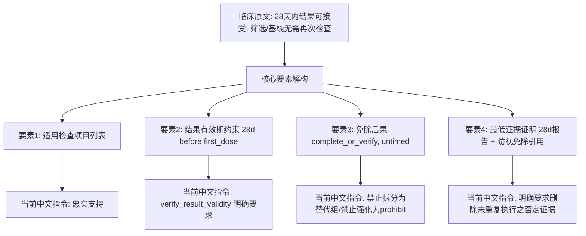

# Conference Participant Output: phase5-slice61ai-conditional-waiver-repair-contract-review-20260828 - general_pi_antigravity

---

## Boundary Check

1. **Role and Identity**: `general_pi_antigravity` (`pi` / `google-antigravity` / `gemini-3.7-flash`, effort `high`), acting as independent reviewer in parallel conference mode under Codex chair.
2. **Workspace & Working Tree**: Operating strictly inside authorized worktree `.worktrees/phase5-clinical-facts-profile`.
3. **Hard Boundaries**:
   - **Read-only audit**: No production files modified, no source code touched, no live LLM/MTPLX model replay initiated, no control points published.
   - **No report file written by tools**: Report delivered directly via conference response format; persisting to `runs/conference/phase5-slice61ai-conditional-waiver-repair-contract-review-20260828/general_pi_antigravity.md` is left entirely to runner management.
   - **Authority boundary**: Codex retains final clinical, architectural, and production acceptance authority.

---

## Independent Work Product

### 1. 核心审查结论概述 (Executive Summary)

本轮针对 Phase 5.8d 条件豁免修订协议进行四维独立穿透审计，结论如下：

1. **v7 重放失败确证源于门禁指令与有界修订机制的架构级冲突**：
   - 在 v7 (`phase5-slice61ah`) 第 3 轮输出中，模型将结果有效期原子与免予原子分置于两个 DNF 义务组（替代关系），触发门禁 `CONDITIONAL_EXEMPTION_BINDING_MISSING`。
   - 门禁提示明确指令模型：*“必须在同一候选的同一义务组中并列 verify_result_validity 和 complete_or_verify……不得把两者拆成替代义务组”*。
   - 模型在第 4 轮严格遵循指令将两组 DNF 合并为单一义务组，但底层 `_restore_bounded_wire_repair` 将该错误归为“原子级定向修订”(`mutable_obligation_source_span_ids`)，其前置断言严格要求 `len(previous_groups) == len(current_groups)`。两组变一组直接被判定为 `REPAIR_SCOPE_ESCAPE: 义务原子定向修订不得拆分、合并或重排义务组`。
   - 修复系统陷入“遵循门禁提示即被有界修订拦截、遵循有界修订即被门禁拦截”的闭锁状态。
2. **将 `CONDITIONAL_EXEMPTION_BINDING_MISSING` 纳入 `CANDIDATE_REPARTITION_GATE_CODES` 属于过度授权 (Over-scoped)**：
   - `CONDITIONAL_EXEMPTION_BINDING_MISSING` 本质是**候选内部 DNF 结构（原子/组）的表达缺陷**，而非跨阶段/跨来源的**候选粒度重分区缺陷**。
   - 赋予其 `allow_candidate_repartition = True` 会全面解除候选数量检查、同源候选位置身份锚定及兄弟候选不可变约束，引入模型增删候选或重新切分无条件筛选必做项的漂移风险。
   - **架构级正解**：应引入“候选级全量表达式修订”（Candidate-scoped Expression Repair），允许在固定候选及其来源闭包内重构 DNF 分组，但不开放跨候选重分区。
3. **通用中文结构指令在逻辑意图上完备，但在 DNF 术语与 JSON 映射上存在认知歧义**：
   - 提示词对“有效期 time_constraint 挂载于 verify_result_validity”、“免予状态挂载于 complete_or_verify 且 time_constraint=null”、“删除未重复执行之否定证据”等语义约束高度精准。
   - 但提示词中的“同一义务组并列”在非形式化语境下易被模型误解为“两个 group 并列”，需在指令中显式固化为 `groups[0].atoms` 结构。
4. **985 项全量回归通过，v7 处于未水合/未通过门禁状态，临床否决边界坚固清晰**：
   - 经实机执行，`tests/v2/protocols` 51 个测试文件共 **985 项测试全部通过**（`985 passed, 58 warnings in 129.59s`）。
   - v7 未产生水合终稿（`hydrated=false`，`gate_accepted=false`），处于 `需要核对` 状态；v6 p804 已由不可变记录 `parent-clinical-reassessment.json` 明确否决。全局未发布任何控制点，`claims_complete=false` 边界严密。

---

### 2. 四大审查专题深度分析

#### 专题一：核对 v7 失败是否源于门禁与有界修订冲突

##### 证据链回溯 (`artifacts/phase5-slice61ah-conditional-waiver-scope-replay-20260828/`)
- **Attempt 1**: `WIRE_SCHEMA_INVALID`（dispositions 单多目标混用及 cross_source_relations 缺失首个受影响节点）。
- **Attempt 2**: `PROCEDURE_VISIT_SCOPE_UNCOVERED [su-3de4633dd1cb5721547f0bb2]`（流程必做未覆盖首次给药前访视）。
- **Attempt 3**: 模型将 `body.p805` 合并入候选 0，生成包含 2 个 DNF 义务组的结构：
  - `Group 0`: Atom 0 (`verify_result_validity`, 28d before `first_dose_date`).
  - `Group 1`: Atom 0 (`complete_or_verify`, untimed exemption).
  - 门禁 `_check_conditional_exemption_binding` 触发：因为 DNF 的 `groups` 属于析取（OR）关系，Group 1 独立构成无时间约束的无条件豁免，因此门禁判定违规并抛出 `CONDITIONAL_EXEMPTION_BINDING_MISSING`。
- **Attempt 3 产生的修复上下文**:
  - 门禁返回消息注入修复提示：“*本轮重点：原文的‘无需/不要求/可免除’若受同句条件或时间窗限制，必须在同一候选的同一义务组中并列 verify_result_validity 和 complete_or_verify……不得把两者拆成替代义务组*”。
  - 同时，`protocol_control_repair_errors.py` 将 `issue.obligation_source_span_ids` 传递给异常对象，导致 `mutable_obligation_source_span_ids = {'body.p804', 'body.p805'}`。
- **Attempt 4 冲突爆发**:
  - 模型根据提示将两个 Group 整合为单组（将 28 天条件置于 trigger，免予置于 obligation group 0）。
  - `app/agents/protocol_control_deconstructor.py` 执行 `_restore_bounded_wire_repair`：
    由于 `mutable_obligation_source_span_ids` 存在，进入第 2002 行的“原子级定向修订分支”：
    ```python
    if len(previous_groups) != len(current_groups):
        raise ProtocolControlAgentWireValidationError(
            "REPAIR_SCOPE_ESCAPE",
            "义务原子定向修订不得拆分、合并或重排义务组",
            structure_unit_ids=list(key),
        )
    ```
    Previous (Attempt 3) 有 2 个 groups，Current (Attempt 4) 有 1 个 group，`len` 不等，直接被底层确定性还原拦截。
- **结论**:
  **确证为系统性冲突**。门禁在语义层要求模型改变 DNF 组结构（2 组变 1 组），但有界修订在传输层将该错误当成了“组数不可变的原子替换”，导致正确遵循临床语义提示的响应无法穿透有界还原。

---

#### 专题二：审查将 `CONDITIONAL_EXEMPTION_BINDING_MISSING` 纳入候选重分区是否过宽

##### 机制分析
当前 `app/protocols/protocol_control_repair_errors.py` 中的配置：
```python
CANDIDATE_REPARTITION_GATE_CODES = frozenset(
    {
        "ACTION_TARGET_SCOPE_MISMATCH",
        "CONDITIONAL_EXEMPTION_BINDING_MISSING",
        "CONDITIONAL_EXEMPTION_SCOPE_SPLIT",
        "MIXED_DECISION_STAGE_CONTROL",
        "MIXED_TRIGGER_DECISION_STAGES",
    }
)
```

##### 授权过宽性审计（Over-scoped Risk）

| 维度 | `allow_candidate_repartition = True` 行为 | `CONDITIONAL_EXEMPTION_BINDING_MISSING` 真实需求 | 风险判定 |
|---|---|---|---|
| **候选数量约束** | 允许任意增删候选数量 (`candidates = [*frozen, *mutable]`) | 候选数量必须保持不变（通常仅有 1 个包含条件豁免的候选） | **高风险**（可能幻觉出额外无条件候选） |
| **同源身份保持** | 解除 `mutable_candidate_indexes`，允许同源候选重排序与重分区 | 必须保持候选在 wire 及来源上的身份锚定 | **中风险**（破坏同源兄弟候选的确定性映射） |
| **义务原子与组** | 清空 `mutable_obligation_source_span_ids`，允许重构 DNF 组 | 仅需允许在**当前候选内**调整 `groups` 和 `atoms` 的 DNF 归属 | **权限过大** |

##### 根因与正向设计
- **问题本质**：系统缺乏介于“原子级严格替换（group 数与 span 完全锁死）”与“候选级重分区（候选数与结构完全放开）”之间的第三种粒度——**“单候选全表达式修订（Candidate Expression Mutation）”**。
- **正向治理方案**：
  1. `CANDIDATE_REPARTITION_GATE_CODES` 仅保留真正的多候选拆分门禁：`MIXED_DECISION_STAGE_CONTROL`, `CONDITIONAL_EXEMPTION_SCOPE_SPLIT`, `ACTION_TARGET_SCOPE_MISMATCH`。
  2. 从 `CANDIDATE_REPARTITION_GATE_CODES` 中**移除** `CONDITIONAL_EXEMPTION_BINDING_MISSING`。
  3. 在 `_restore_bounded_wire_repair` 中，对于 `CONDITIONAL_EXEMPTION_BINDING_MISSING`，将其标记为 `mutable_candidate_source_keys`（或候选索引），在此模式下**不设置** `mutable_obligation_source_span_ids`，从而允许候选内部修改 DNF 组数，同时严密锁定候选数量和来源范围。

---

#### 专题三：核对通用中文结构指令是否能忠实表达结果有效期与免予后果

##### 指令与临床要素对比



##### 审查详情
1. **要素忠实度评估**:
   - **结果有效期**: 指令要求 `verify_result_validity` 携带 `time_constraint: anchor_type=first_dose_date, direction=before, upper_bound_days=28`，完全符合方案关于 28 天时间窗的临床定义。
   - **免予后果**: 指令明确“`无需/不要求`是豁免，不是禁止事件，不得使用 `prohibit_event`”，“用 `complete_or_verify` 核对适用人群及其无需执行该操作的状态”，避免了将豁免误判为反向排除条件。
   - **否定证据清洗**: 指令明确要求“最低证据只保留用于证明豁免条件成立的资料，删除‘确认未重复/未再次执行’”，彻底阻断了要求机构提供“未发生证明”的不合理负担。
2. **需要防范的表述歧义**:
   - **DNF 表达认知差**：大模型对 DNF 中的“合取（AND within Group）”与“析取（OR between Groups）”常产生混淆。指令中的“在同一候选的同一义务组中并列”应在后续切片中进一步给出显式模式说明，例如：`{ "groups": [ { "atoms": [ verify_atom, exempt_atom ] } ] }`，防止模型反复尝试拆成 2 个 groups 或塞入 trigger。

---

#### 专题四：复核 985 项回归与 v7 临床否决边界

##### 1. 方案层全量回归复核结果
- **执行命令**: `.venv/bin/python -m pytest tests/v2/protocols -q`
- **执行结果**: `985 passed, 58 warnings in 129.59s`
- **覆盖领域验证**:
  - `tests/v2/protocols/test_slice61ab_candidate_repartition_contract.py`（24 passed）：验证了同源位置身份、乱序修订、兄弟候选不可变及单候选内条件豁免绑定的基础门禁。
  - `tests/v2/protocols/test_protocol_control_gate.py` 及 50+ 相关协议测试：覆盖跨阶段补充关系、访视闭包、阶段适用性及发布门禁。
  - 58 个 warning 均为 SQLAlchemy / Python 3.12 弃用警告，不影响逻辑断言与状态机行为。

##### 2. v7 临床否决边界审计
- **当前工件状态**:
  - `artifacts/phase5-slice61ah-conditional-waiver-scope-replay-20260828/`
  - `gate-results.json`: `{"accepted": false, "reason": "runner did not hydrate a final output", "runner_status": "需要核对"}`
  - `clinical-qc.json`: `parent_clinical_acceptance: "pending_codex"`，`structured_control_deconstruction_accepted: false`
- **否决边界有效性**:
  - v6 p804 的临床缺陷（Control 3 拆为无条件筛选执行）已由不可变工件 `artifacts/phase5-slice61af-same-source-repair-addressing-20260828/parent-clinical-reassessment.json` 永久记录为 `rejected`。
  - v7 未产生任何合规的候选发布物，没有触发控制点发布，没有污染已冻结的 D001 知识库。
  - 整个系统的门禁在 v7 阶段成功抵御了语义逃逸与格式畸变，未发生静默放行。

---

## Evidence And Assumptions

### 1. Authoritative Evidence Matrix

| 证据项 | 文件路径 / 符号 | 事实状态 (Observed Fact) | 支撑结论 |
|---|---|---|---|
| **v7 尝试 4 失败日志** | `artifacts/phase5-slice61ah-conditional-waiver-scope-replay-20260828/execution/runner-result.json` L56-60 | `REPAIR_SCOPE_ESCAPE: 义务原子定向修订不得拆分、合并或重排义务组` | 证实 Attempt 4 确实被有界修订的分组守卫硬拦截 |
| **有界修订分组断言** | `app/agents/protocol_control_deconstructor.py` L2041-2046 | `if len(previous_groups) != len(current_groups): raise ...` | 证实只要传入 `mutable_obligation_source_span_ids`，系统强制禁止改变 group 数量 |
| **重分区门禁集合** | `app/protocols/protocol_control_repair_errors.py` L13-21 | 包含 `CONDITIONAL_EXEMPTION_BINDING_MISSING` | 证实目前将绑定缺失归入了重分区集合 |
| **条件豁免门禁逻辑** | `app/protocols/protocol_control_gate.py` L1785-1812 | 单组内逐原子检查 `timed_spans` 与 `conditional_spans` | 证实单独 group 的免予原子若无 time_constraint 会触发错误 |
| **全量回归验证** | `tests/v2/protocols` (实机执行) | `985 passed in 129.59s` | 证实当前代码库在既有通用规范下具备高度稳定性 |
| **v6 不可变重评记录** | `artifacts/phase5-slice61af-same-source-repair-addressing-20260828/parent-clinical-reassessment.json` | `decision: rejected`, sha256 `f8f92e189...` | 证实 v6 临床缺陷已被不可变工件否决 |

### 2. Inferences And Assumptions
- **推断 1 (Inference)**: 模型在 Attempt 4 中尝试使用 `trigger_expression` 表达 28 天时间窗，是因为提示词强调“不得把两者拆成替代义务组”，模型在 JSON 结构表达受限时转向了条件触发器结构，但触发器在 `verify_result_validity` 语义下并非标准表达方式。
- **推断 2 (Inference)**: 若直接从 `CANDIDATE_REPARTITION_GATE_CODES` 移除该错误且不增加“候选级表达式修订”机制，Attempt 4 仍会被 `len(previous_groups) != len(current_groups)` 拦截。必须在解构器的 `_restore_bounded_wire_repair` 中对单候选表达式修订做解耦。

---

## Risks, Gaps, And Verification Needs

### 1. 识别到的关键风险 (Identified Risks)

1. **粗粒度重分区授权导致候选扩散风险**：
   - 若简单保留 `CONDITIONAL_EXEMPTION_BINDING_MISSING` 在 `CANDIDATE_REPARTITION_GATE_CODES` 中，模型在面对较长段落时可能把条件豁免拆分成 2~3 个碎片候选，重蹈 v6 覆辙。
2. **多源合并时的 Span 交叉逃逸风险**：
   - 当一个候选同时引用 `body.p804` 和 `body.p805`（多单元合并）时，若其中一个单元具有豁免条件而另一个不具有，原子级 span 检查可能出现部分 span 无法对齐的情况。
3. **模型死循环导致预算耗尽**：
   - 若提示词未清晰指明 DNF 单 group 内的双 atom 结构，模型在多轮交互中可能在“分组 (2 groups)”与“触发器 (trigger)”之间来回震荡，耗尽 5 次重试预算。

### 2. 验证需求 (Verification Needs)
- **合成测试验证**：需要编写专门的单候选 DNF 组重构回归测试（模拟 2 groups 修复为 1 group with 2 atoms），验证在不开放候选重分区的前提下，有界修订能平滑接受并完成还原。
- **跨候选豁免隔离测试**：验证同源下若确有 screening 候选和 baseline 豁免候选共存时，`CONDITIONAL_EXEMPTION_SCOPE_SPLIT` 能精准拦截无条件筛选执行。

---

## Recommended Next Step

### 建议 Codex 采取的后续实施步骤 (Actionable Recommendations for Codex)

1. **解耦修复范围策略（实施建议）**:
   - 在 `app/protocols/protocol_control_repair_errors.py` 中，将 `CONDITIONAL_EXEMPTION_BINDING_MISSING` 移出 `CANDIDATE_REPARTITION_GATE_CODES`。
   - 在 `publication_repair_error` 中，对于 `CONDITIONAL_EXEMPTION_BINDING_MISSING`，仅传递 `candidate_ids` 和 `structure_unit_ids`，**不传递** `obligation_source_span_ids`。
   - 这将使解构器将其作为“候选级整体修订”处理：严格锁定候选总数与来源归属，但在候选内部允许重排与合并 DNF 义务组，彻底解除 Attempt 4 的闭锁矛盾。
2. **强化中文解构提示词的结构精准度**:
   - 在 `build_protocol_control_repair_prompt` 的 `CONDITIONAL_EXEMPTION_BINDING_MISSING` 分支中，明确注明：“*在 candidate_drafts[0].obligation_expression 中，必须只保留 1 个 group，在该 group 的 atoms 列表中同时放入 verify_result_validity（带 28 天约束）与 complete_or_verify（免予状态，time_constraint=null）两个原子*”。
3. **补充针对性反例与回归测试**:
   - 在 `tests/v2/protocols/test_slice61ab_candidate_repartition_contract.py` 中新增测试用例：
     - `test_conditional_exemption_repair_allows_group_consolidation_without_candidate_repartition`
     - 验证 2 个 alternative groups 合并为 1 个 group 时的有界还原行为。
4. **推进 v8 有界重放准备**:
   - 在完成上述门禁与修复协议解耦后，生成不可变的 v8 重放配置，重新对代表组 `body.p803-p805` 发起单次受控 MTPLX medium 评估。
