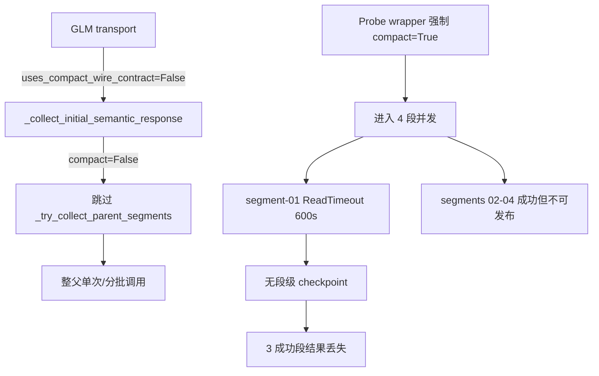

按分配先做只读追踪：读取执行上下文与计划，再定位 GLM 分段、wire、缓存与错误映射相关代码。
# Execution Output: phase5-segment-capability-checkpoint-recovery-20260901 - worker_01

## Boundary And Context Check

- **Role**: `worker_01` — 只读追踪与最小修复边界建议；**未修改任何生产文件**。
- **工作目录**: `.worktrees/phase5-clinical-facts-profile`（授权 worktree）。
- **已读上下文**: `context/phase5-segment-capability-checkpoint-recovery-20260901_execution_context.md`、`plans/codex_execution_phase5-segment-capability-checkpoint-recovery-20260901.md`。
- **边界遵守**: 无生产写入；未触碰 D001 / 失败 SAR / 冻结临床源；引用既有 GLM 分段探针归档证据作为运行时观测，不将其当作验收结论。

---

## Work Performed

对 GLM 父规则分段相关链路做了只读端到端追踪，覆盖：**传输能力声明 → 分段进入条件 → 并发执行 → 错误映射 → 缓存/检查点接口及调用方**，并据此提出最小通用修复边界与兼容性风险。

### 1. GLM 传输能力声明

| 位置 | 机制 | 观测 |
|---|---|---|
| `app/agents/deepseek_protocol_transport.py:40-46` | `_ZHIPU_BACKENDS = {"zhipu-coding-plan","glm"}`；`_LOCAL_STRUCTURED_BACKENDS = {"omlx","mtplx","mtplx-api"}` | GLM 与 MTPLX/oMLX 分属不同后端集合 |
| `deepseek_protocol_transport.py:272-274` | `uses_compact_wire_contract` | **仅** `_LOCAL_STRUCTURED_BACKENDS` 返回 `True`；GLM 恒为 `False` |
| `deepseek_protocol_transport.py:288-295` | `_completion_kwargs` | GLM 使用 `response_format={"type":"json_object"}`；compact strict schema 仅 local backends |
| `deepseek_protocol_transport.py:228-246` | `configure_output_scope` | 存在，但下游仅在 compact wire 路径调用 |
| `deepseek_protocol_transport.py:248-270` | `semantic_cache_identity` | 哈希 backend/model/reasoning_effort/请求 kwargs（含 response_format） |
| `deepseek_protocol_transport.py:218-223` | OpenAI client | `timeout=600.0`, `max_retries=0` |

**结论（证据）**: GLM 传输层**没有**独立的“父规则分段能力”声明；现有唯一相关旗标是 `uses_compact_wire_contract`，且 GLM 被排除在外。

### 2. 父规则分段进入条件

| 层级 | 位置 | 条件 |
|---|---|---|
| 规划器 | `app/protocols/parent_rule_semantic_segmentation.py:282-343` `plan_parent_rule_segments` | `enabled`、token 软阈值、最少 source spans / obligations、可闭合单元 ≥2 批、结构 fail-closed（开放括号/续接） |
| 配置 | `app/config.py:169-192` | `DECONSTRUCT_PARENT_SEGMENT_*` 环境变量；默认 concurrency=2 |
| 运行器门控 | `protocol_deconstructor.py:3701,3737-3738` | `compact = _uses_compact_wire_contract(transport)`；**仅 compact 时**调用 `_try_collect_parent_segments` |
| 段收集硬门 | `protocol_deconstructor.py:3515-3516` | `_collect_parent_segment` 非 compact 直接 `raise ValueError` |
| 单父规则 | `protocol_deconstructor.py:3608` | `len(rule_codes) != 1` 则跳过 |
| transport_factory | `protocol_deconstructor.py:3608` | 为 `None` 则跳过 |

**结论（证据+推断）**: 生产路径下 GLM **永远无法进入分段**——不是因为规划器拒绝，而是因为 `uses_compact_wire_contract=False` 在运行器层被短路。  
GLM 探针 worker_02 通过 probe wrapper 强制 `uses_compact_wire_contract=True` 才触发了 4 段路径（`RecordingTransport` in `artifacts/.../run_segmented_glm_live_probe.py:157-162`）。

### 3. 并发执行

| 位置 | 行为 |
|---|---|
| `parent_rule_semantic_segmentation.py:59-62` | `clamp_parent_segment_concurrency`：非法值→2，硬顶 3 |
| `protocol_deconstructor.py:3630-3647` | `ThreadPoolExecutor`，`max_workers=min(segment_count, clamped_concurrency)` |
| `protocol_deconstruction_executor.py:673,635` | `transport_factory=lambda: _resolve_transport(config)` — 每段 fresh transport |
| 探针实测 | `preflight-segmentation-plan.json`: `max_concurrency=2`；`call-ledger.json`: 7 calls / 5 transports，峰值并发 ≤2 |

### 4. 错误映射

| 场景 | 路径 | 分类 |
|---|---|---|
| HTTP 超时 | `deepseek_protocol_transport.py:451-453` → `ProtocolAgentCallError` | 600s `httpx.ReadTimeout` |
| 段内 schema 修复 | `protocol_deconstructor.py:3560-3593` | 最多 2 次（parse/validate + 1 repair） |
| 任一段失败 | `protocol_deconstructor.py:3683-3689` | **宽泛** `except Exception` → log warning → `return None` → 整父回退 |
| 路由摘要 | `protocol_semantic_model_router.py:335-360` | `会话异常`→`SESSION_ANOMALY`；`输出格式无效`→`SCHEMA_INVALID`；**无 TIMEOUT 专用类** |
| 探针硬停 | `segmentation-failure.json` | segment-01 timeout；`whole_parent_fallback_used: false` |

**结论（证据）**: 超时与 schema 错误在段路径**未分离**；超时在 `_try_collect_parent_segments` 与 schema 错误一样触发整父回退（生产）或全量失败（探针硬停）。  
探针中 segment-01 在 **600.154s** 超时，segments 02–04 已成功但未持久复用。

### 5. 缓存 / 检查点接口与调用方

| 组件 | 位置 | 契约 |
|---|---|---|
| 协议 | `protocol_deconstructor.py:189-194` | `ProtocolSemanticBatchCache.load/store` |
| 文件实现 | `protocol_deconstruction_executor.py:135-185` | job-scoped `blobs/protocol-semantic-batches/{job_id}/{sha256}.json` |
| 键生成 | `protocol_deconstructor.py:3434-3459` `_semantic_batch_cache_key` | `cache_contract` + `transport.semantic_cache_identity` + **完整 prompt** + `batch_id` + `rule_codes` |
| 段缓存 | `protocol_deconstructor.py:3540` | `cache_contract="protocol-semantic-parent-segment/v1"`，`batch_id=segment.segment_id` |
| 存储标签 | `executor.py:170` | store 时**固定**写 `"cache_contract":"protocol-semantic-batch/v1"`（与段 contract 不一致） |
| 调用方 | `protocol_deconstruction_executor.py:624-635,672-673` | `_run_semantic_generation_with_routing` 注入 `batch_cache` + `transport_factory` |
| workflow checkpoint | `protocol_deconstruction_executor.py:194-195` | step 级 `last_checkpoint` 重放；**无段级 checkpoint** |

**缓存键缺口（推断）**: 未显式纳入 `protocol_file_sha256`、`extraction_snapshot_id`、`prompt_template_sha256`；段身份部分依赖 `segment_id`（确定性：`{official_code}#segment-{nn}-of-{tt}`）和嵌入 prompt。模型/提示漂移时可能误复用或无法跨 run 复用成功段。

### 6. 根因链（GLM 探针暴露）



---

## Artifacts And Evidence

| 证据 | 路径 | 用途 |
|---|---|---|
| 传输能力 | `app/agents/deepseek_protocol_transport.py` | GLM compact wire=False |
| 分段门控 | `app/agents/protocol_deconstructor.py:3312-3690` | compact 耦合点 |
| 规划器 | `app/protocols/parent_rule_semantic_segmentation.py` | 确定性 4 段 `[3,3,3,2]` |
| 配置 | `app/config.py:169-192` | 分段阈值/并发 |
| 缓存 | `app/services/protocol_deconstruction_executor.py:135-185` | job 文件缓存 |
| 路由错误类 | `app/agents/protocol_semantic_model_router.py:335-360` | 无 TIMEOUT 类 |
| GLM 探针失败 | `artifacts/.../glm-segmented-parent-probe-ex06-20260901/segmentation-failure.json` | segment-01 timeout |
| 探针台账 | `.../run-segmented/call-ledger.json` | 3/4 成功、7 calls |
| 探针预检 | `.../preflight-segmentation-plan.json` | 4 segments, concurrency 2 |
| 离线验收 CP | `.trellis/tasks/.../CHECKPOINT_20260901_LARGE_PARENT_HIERARCHICAL_SEGMENTATION_ACCEPTED_LIVE_PENDING.md` | 规划器已验收，live pending |
| 对抗测试 | `tests/v2/protocols/test_parent_rule_semantic_segmentation.py` | 全部用 `uses_compact_wire_contract=True` fake transport |

---

## Commands And Observations

```bash
# 关键符号定位
rg -n "uses_compact_wire_contract|_try_collect_parent_segments|_semantic_batch_cache_key" \
  app/agents/protocol_deconstructor.py app/agents/deepseek_protocol_transport.py

rg -n "DECONSTRUCT_PARENT_SEGMENT" app/config.py

# 探针结果只读
cat artifacts/phase5-acceptance/20260901/glm-segmented-parent-probe-ex06-20260901/segmentation-failure.json
```

| 观测 | 类型 | 说明 |
|---|---|---|
| GLM 生产路径跳过分段 | **证据** | `uses_compact_wire_contract=False` |
| 探针需 wrapper 才分段 | **证据** | `run_segmented_glm_live_probe.py:157-162` |
| 规划器对 EX-06 产出 4 段 | **证据** | `preflight-segmentation-plan.json` |
| segment-01 @600s 超时 | **证据** | `segmentation-failure.json`, `transport-02-call-01.json` |
| segments 02–04 成功无合并 | **证据** | `call-ledger.json`；无 `merged-segment-candidate.json` |
| 段失败→整父回退（生产） | **证据** | `protocol_deconstructor.py:3683-3689` |
| 缓存 store contract 不一致 | **证据** | 段读 `protocol-semantic-parent-segment/v1`，写 `protocol-semantic-batch/v1` |

---

## Blockers Or Missing Environment

1. **机制耦合（主阻塞）**: 分段能力与 compact wire 绑定，GLM 无法走生产分段路径。
2. **无段级 checkpoint**: 部分成功不可复用；重跑需重调全部段。
3. **超时/Schema 未分类**: 无法对同模型同段做有限超时恢复。
4. **本 worker 范围**: 只读分析已完成；实施留给 `worker_02`，对抗测试留给 `worker_03`。

---

## Rerun Requests Or Next Step

### 最小通用修复边界（供 worker_02）

**应改（最小面）**:

1. **新增独立能力声明**（`DeepSeekProtocolAgentTransport` 或 Protocol 扩展）  
   - `supports_parent_rule_segmentation: bool` — GLM/MTPLX/oMLX 可为 `True`；DeepSeek 等保持 `False`  
   - **保留** `uses_compact_wire_contract` 仅管 wire/schema 形态，不再兼管分段门控

2. **解耦门控点**（`protocol_deconstructor.py`）  
   - `_collect_initial_semantic_response` / `_try_collect_parent_segments` / `_collect_parent_segment`：用 `supports_parent_rule_segmentation` 替代 compact 检查  
   - 段内 `compact=` 参数改为按 transport wire 能力选择（GLM: `json_object` + domain/compact parse；MTPLX: strict compact wire）

3. **确定性段 checkpoint**（扩展 `ProtocolSemanticBatchCache` 或同级接口）  
   键必须包含：  
   - `protocol_file_sha256`  
   - `extraction_snapshot_id`  
   - `prompt_template_sha256`（或 `prompt_version`）  
   - `semantic_cache_identity`（模型身份）  
   - `segment_id`（已确定性）  
   - `cache_contract` 读写一致（`protocol-semantic-parent-segment/v1`）

4. **错误分类 + 有限恢复**  
   - 超时：`TRANSPORT_TIMEOUT` — 同模型同段 **1 次**有限重试（可调超时或独立 timeout 配置）  
   - Schema：`SCHEMA_INVALID` — 保持现有 1–2 次 repair，**不**触发跨段回退  
   - 仅当全部段失败或合并/门禁失败时才整父回退（可配置，与探针硬停策略对齐）

5. **部分结果隔离**  
   - 成功段写入 checkpoint；失败段可单独重试  
   - 合并前禁止发布；禁止跨 provider 拼接（维持 `transport_factory` 同模型约束）

**明确不改**:
- `parent_rule_semantic_segmentation.py` 规划逻辑（已离线验收）
- 冻结临床源、D001、旧探针产物
- 项目/疾病/药物/条款号硬编码

### 兼容性风险

| 风险 | 级别 | 缓解 |
|---|---|---|
| MTPLX/oMLX compact wire 回归 | 高 | 保持 `uses_compact_wire_contract` 语义不变；分段门控用新旗标 |
| 非分段 transport 误入 | 中 | 默认 `supports_parent_rule_segmentation=False`；对抗测试覆盖 |
| 缓存键变更致旧缓存失效 | 低–中 | 新 contract 版本号；旧键自然 miss |
| GLM `json_object` vs strict schema 解析差异 | 中 | 段路径 parse 分支按 wire 能力；沿用探针已验证的 dnf-v1 输出 |
| `configure_output_scope` 仅 compact | 中 | GLM 分段可跳过 scope 或提供宽松 scope |
| 整父回退行为变化 | 中 | 配置开关 + 保留现有 fail-closed 默认 |
| 超时重试放大成本 | 低 | 每段最多 1 次；复用 checkpoint 避免重复成功段 |

### 给 Codex / worker_02 的精确问题

1. 生产分段路径是否允许 **同模型整父回退**（现有 `3683-3689`），还是探针式 **硬停**？
2. GLM 段调用超时：沿用 600s 还是分段专用更长 timeout？
3. 段 checkpoint 是否跨 job 持久（同一 frozen package 重跑），还是仅 job-scoped？

**worker_02 实施入口文件**:  
`app/agents/deepseek_protocol_transport.py`、`app/agents/protocol_deconstructor.py`（3312–3690, 3434–3459）、`app/services/protocol_deconstruction_executor.py`（135–185）。
