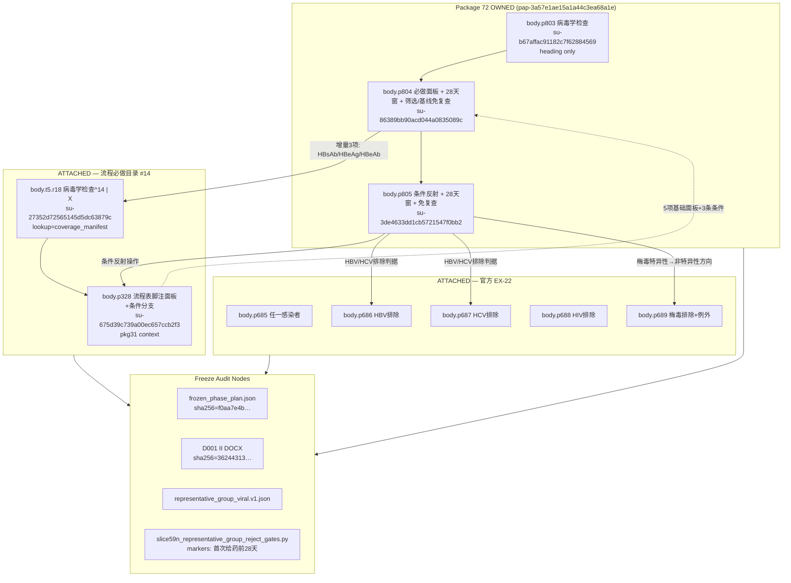

Trellis SessionStart 已加载。正在读取执行上下文与计划文件，以建立 body.p803–p805 病毒学检查的来源闭包。
# Execution Output: phase5-slice60zx-virology-source-closure-20260828 - worker_01

## Boundary And Context Check

- **Role**: `worker_01` — read-only source authority mapping; **no file modifications**, no model calls, no publication.
- **Workspace**: `.worktrees/phase5-clinical-facts-profile` only.
- **Initial read set consumed**:
  - `context/phase5-slice60zx-virology-source-closure-20260828_execution_context.md`
  - `plans/codex_execution_phase5-slice60zx-virology-source-closure-20260828.md`
- **Additional evidence read** (justified: establish package-72 identity, verbatim DOCX text, cross-chapter attachments, prior V10 acceptance anchors):
  - `artifacts/phase5-slice59i-d001-phase-table-caption-rebaseline-20260827/frozen_phase_plan.json`
  - `.trellis/tasks/08-22-phase5-clinical-facts-profile/research/d001-ii-phase-closure/slice59n-prepare/d001-ii-viral-cross-chapter/source_rows.json`
  - `.trellis/tasks/08-22-phase5-clinical-facts-profile/research/d001-ii-phase-closure/configs/representative_group_viral.v1.json`
  - `artifacts/phase5-slice59n-d001-viral-control-replay-contract-v10-20260828/{compact-handoff.md,clinical-qc.json,agent-controls.json}`
  - `artifacts/phase5-slice60zu-laboratory-action-preservation-rerun-20260828/catalogs/{required_procedures.json,official_parent_rules.json}`
  - Protocol block blob (via `artifacts/phase5-slice60zo-laboratory-package70-71-dryrun-20260828/_tmp_product_chain/blobs/protocol_blocks/*.json`)
- **Package identity confirmed**: Activity 131 freeze plan **package 72** = `packages[71]` in frozen plan; `package_id = pap-3a57e1ae15a1a44c3ea68a1e`. Package 72 **owns** `body.p802`–`body.p813` (virology + TB); this slice scopes to **`body.p803`–`body.p805` only**.
- **Protocol DOCX fingerprint** (prior accepted baseline): SHA-256 `362443131f0d384c82c80f6a37396084f7d3301b51162201749c0488b0f2dd98`.
- **Frozen plan fingerprint**: SHA-256 `f0aa7e4bccad782ad5472c1f446f079e26343f694ad3ddca401bfbef89f38250`.

---

## Work Performed

Built a read-only **source authority graph** linking `body.p803`–`body.p805` to:
1. Real DOCX paragraph text (verified from protocol block blob),
2. Activity 131 package-72 owned units,
3. Cross-chapter **attached** authorities (flow catalog #14, flow footnote, EX-22),
4. Freeze audit nodes and blind parent medical checklist items,
5. Mandatory AND/OR logic, antibody panel distinctions, and time anchors.

---

## Artifacts And Evidence

### 1. Source Authority Graph (body.p803–p805 core)

**Evidence**: Package 72 alone **cannot** close virology without attachments — `slice59n_representative_group_reject_gates.py` explicitly flags `CONTEXT_BLIND_CROSS_CHAPTER` when EX/flow attachments are missing.

---

### 2. Verbatim DOCX Owned Text (protocol block blob)

| source_ref | Verbatim text | structure_unit_id |
|---|---|---|
| `body.p803` | 病毒学检查 | `su-b67affac91182c7f62884569` |
| `body.p804` | 将根据标准实验室程序进行包括**乙肝表面抗原、乙肝表面抗体、乙肝e抗原、乙肝e抗体、乙肝核心抗体、丙型肝炎病毒抗体、人类免疫缺陷病毒抗体、梅毒特异性抗体**检查。可接受在**首次给药前28天内**的结果，**筛选期/基线期无需再次检查**。 | `su-86389bb90acd044a0835089c` |
| `body.p805` | **乙型肝炎表面抗原阴性且乙型肝炎核心抗体阳性**的参与者，需要进行**HBV-DNA**检测；**丙型肝炎病毒抗体阳性**的参与者，需要进行**HCV-RNA**检测。若**梅毒特异性抗体检查阳性**，则进行**梅毒非特异性抗体**检查。可接受在**首次给药前28天内**的结果，**无需再次检查**。 | `su-3de4633dd1cb5721547f0bb2` |

Heading path (all three): `研究评估和程序 > 研究期间的检查和评估 > 病毒学检查`.

---

### 3. Cross-Chapter Attached Authorities

#### A. 流程必做目录 #14 (`body.t5.r18` + `body.p328`)

| Field | Value |
|---|---|
| Catalog label | 病毒学检查 |
| Position | 14 (flow row 18) |
| Visit | 筛选期(D-28~D-1) |
| Matrix mark | `病毒学检查^14 \| X` |
| Footnote `body.p328` panel | HBsAg, HBcAb, HCVAb, HIVAb, 梅毒特异性抗体 (**5 items**) |
| Footnote conditionals | ① HBsAg阴性**且**HBcAb阳性 → HBV-DNA定量; ② HCVAb阳性 → HCV-RNA定量; ③ 梅毒特异性阳性 → 梅毒非特异性 + 研究者判断已治愈 |

**Must preserve**: Flow footnote is the authoritative source for **conditional reflex panel**; `p804` expands the **screening panel** beyond footnote (adds HBsAb, HBeAg, HBeAb).

#### B. 官方 EX-22 (`body.p685`–`body.p689`)

| source_ref | Logic | Must preserve |
|---|---|---|
| `body.p685` | 筛选访视时存在下列**任一**感染者 | Top-level **OR** across infection types |
| `body.p686` | HBsAg阳性 **或** (HBcAb阳性 **且** HBV-DNA拷贝数阳性) | HBV: **OR** outer; **AND** inner for core-ab+/DNA+ |
| `body.p687` | HCVAb阳性 **且** HCV-RNA拷贝数阳性 | HCV: **AND** (antibody + RNA) |
| `body.p688` | HIV Ab阳性 | Single positive criterion |
| `body.p689` | 梅毒特异性阳性 (**除外**: 非特异性阴性 + 研究者判断已治愈) | Syphilis: specific→non-specific direction + **professional judgment exception** |

**Evidence**: `official_parent_rules.json` EX-22 spans `body.p685`–`body.p689`.

---

### 4. Mandatory AND/OR, Antibody Types, Time Anchors

#### body.p804 — unconditional screening panel

| Dimension | Must preserve |
|---|---|
| Panel (8 tests) | HBsAg, HBsAb, HBeAg, HBeAb, HBcAb, HCVAb, HIVAb, 梅毒特异性抗体 — all **AND** (single mandatory set) |
| Increment vs flow #14 | HBsAb, HBeAg, HBeAb are **incremental** over `body.p328` 5-item panel |
| Time anchor | `first_dose_date`, direction=`before`, `upper_bound_days=28` |
| Re-screen exemption | **筛选期/基线期无需再次检查** (explicit screening/baseline waiver) |
| Review stage split | Screening obligations (3 incremental tests) vs baseline validity (28-day window) must stay **separate candidates** |

#### body.p805 — three conditional reflex branches (OR across branches)

| Branch | Trigger (AND within branch) | Consequent | Direction |
|---|---|---|---|
| **B1** | HBsAg阴性 **且** HBcAb阳性 | HBV-DNA检测 | Specific panel → nucleic acid reflex |
| **B2** | HCVAb阳性 | HCV-RNA检测 | Antibody → RNA reflex |
| **B3** | 梅毒特异性抗体阳性 | 梅毒非特异性抗体检查 | **Specific → non-specific** (must not reverse) |

| Shared consequence | Must preserve |
|---|---|
| Time anchor | `first_dose_date`, `before`, 28 days — binds **all 3 branches** via `applies_to_trigger_branch_ids` |
| Re-screen | **无需再次检查** (no screening/baseline wording — differs from p804) |
| Trigger structure | **3 separate trigger branches**; shared validity = 1 obligation group listing all branch IDs |

**V10 accepted structure reference** (`agent-controls.json`): trigger IDs `pct-1b72cc…` (HBV), `pct-f506f5…` (HCV), `pct-a49726…` (syphilis).

#### Syphilis direction (cross-source alignment)

| Source | Direction |
|---|---|
| `body.p328` / `body.p805` | 特异性阳性 → 非特异性复查 (operational reflex) |
| `body.p689` (EX-22) | 特异性试验阳性 = exclusion (**unless** 非特异性阴性 + 研究者判断已治愈) |
| Must preserve | Operational reflex direction **specific→non-specific**; EX-22 exception layer is **attached only**, not duplicated as new control |

---

### 5. Blind Parent Medical Checklist (Codex QC — no Agent clinical copy)

Derived from `clinical-qc.json` codex_clinical_checks + freeze markers; status = **pending_codex** (blind checklist for worker_03 / Codex):

| Check ID | Source scope | Question |
|---|---|---|
| `flow14_screening_required` | `body.t5.r18` | Is virology #14 marked mandatory at screening? |
| `flow14_panel_and_conditionals` | `body.p328` | Does flow footnote preserve 5-item panel + 3 conditionals with correct AND/OR? |
| `ex22_source_closure` | `body.p685`–`p689` | Are EX-22 OR-top / HBV OR+(AND) / HCV AND / syphilis exception attached? |
| `viral_panel_complete` | `body.p804` | Does 8-item panel include HBsAb/HBeAg/HBeAb increment over flow footnote? |
| `first_dose_minus_28d_validity` | `body.p804`, `body.p805` | Is 28-day window anchored to `first_dose_date` on both units? |
| `conditional_reflexives` | `body.p805` | Are 3 trigger branches preserved with specific→non-specific syphilis direction? |
| Marker gate | `body.p804`, `body.p805` | Frozen excerpt contains **首次给药前28天** (`VIRAL_TB_REQUIRED_MARKERS`) |

**Disposition expectations for owned units** (from V10 pattern):
- `body.p803`: non-candidate (heading only)
- `body.p804`: 2 candidates (screening increment + baseline validity)
- `body.p805`: 1 candidate (conditional validity with 3 trigger branches)

---

### 6. Freeze Audit Node Inventory

| Node | Path / ID | Role |
|---|---|---|
| Frozen plan | `artifacts/phase5-slice59i-d001-phase-table-caption-rebaseline-20260827/frozen_phase_plan.json` | Package 72 unit packing |
| Coverage manifest | `d001-ii-phase-closure-20260827-slice59i-table-caption-rebaseline-manifest` | Resolves `body.t5.r18` |
| Representative config | `configs/representative_group_viral.v1.json` | Defines owned vs attached refs |
| Source rows (prepare) | `slice59n-prepare/d001-ii-viral-cross-chapter/source_rows.json` | Role/lookup/ordinal map |
| Reject gates | `slice59n_representative_group_reject_gates.py` | Structural closure enforcement |
| V10 accepted artifact | `artifacts/phase5-slice59n-d001-viral-control-replay-contract-v10-20260828/` | Prior publication pattern (reference only) |
| Catalog IDs | `pcm-row-2a4db6b98190f7f0c22da3b3` (procedure), `pcm-row-759cd0638a6a427a10a3bceb` (EX-22) | Cross-source relation targets |

---

## Commands And Observations

| Tool | Target | Observation |
|---|---|---|
| Read | execution context + plan | Confirmed worker_01 scope: read-only authority graph |
| Grep/Glob | `p803`, `p804`, `p805`, package 72 | Located prior viral cross-chapter artifacts |
| Python | `frozen_phase_plan.json` packages[71] | Package 72 = `pap-3a57e1ae15a1a44c3ea68a1e`; owns p802–p813; p803–p805 under heading 病毒学检查 |
| Python | Cross-package search | `body.p328` in pkg 31/35 context; EX-22 p685–p689 in pkg 55–56; `body.t5.r18` only via coverage_manifest |
| Python | Protocol block blob | Verbatim p803–p805 text matches frozen excerpts |
| Python | SHA-256 | frozen_plan=`f0aa7e4b…`; DOCX=`36244313…` (from checkpoint) |
| Read | `agent-controls.json`, `clinical-qc.json`, `source_rows.json` | Confirmed 3-branch p805 triggers, p804 stage split, attached ref set |

**Key inference (not final acceptance)**: For a **p803–p805-only dry-run** (worker_02), minimum attached set = `{body.t5.r18, body.p328, body.p685, body.p686, body.p687, body.p688, body.p689}`. Omitting any triggers `CONTEXT_BLIND_CROSS_CHAPTER`.

**Uncertainty**: `body.p803` is structurally a section heading with no assessable clinical predicate; whether it receives a disposition-only row vs. groups with p804 is a product contract choice — V10 treated it as owned with no candidates.

---

## Blockers Or Missing Environment

- **None blocking read-only authority mapping.**
- Execution context `Source Of Truth` section still marked TODO; worker_01 resolved authorities from workspace freeze artifacts (consistent with prior slice59n/slice60x pattern).
- **No independent re-parse of raw DOCX file** performed; verbatim text verified via existing protocol block blob chain (same SHA-256 as accepted V10).

---

## Rerun Requests Or Next Step

**For Codex**:
1. Confirm package-72 **p803–p805-only** attached set matches `{t5.r18, p328, p685–p689}` before worker_02 dry-run.
2. Confirm blind checklist items above are sufficient for worker_03 medical QC.

**For worker_02** (out of scope here):
- Build immutable dry-run package scoped to owned=`{p803,p804,p805}` + required attachments; fingerprint against frozen plan + DOCX SHA-256.

**For worker_03** (out of scope here):
- Adversarial review against checklist: HBV **AND**, HCV single-positive trigger, syphilis specific→non-specific, 28-day window, screening/baseline waiver on p804 vs p805 wording difference, EX-22 exception not duplicated.

**Resume point if budget stops**: Authority graph complete; worker_02 may proceed from `representative_group_viral.v1.json` with owned refs narrowed to p803–p805 and attached refs unchanged.
